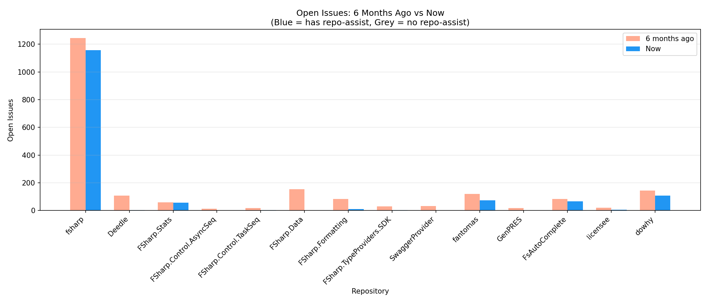
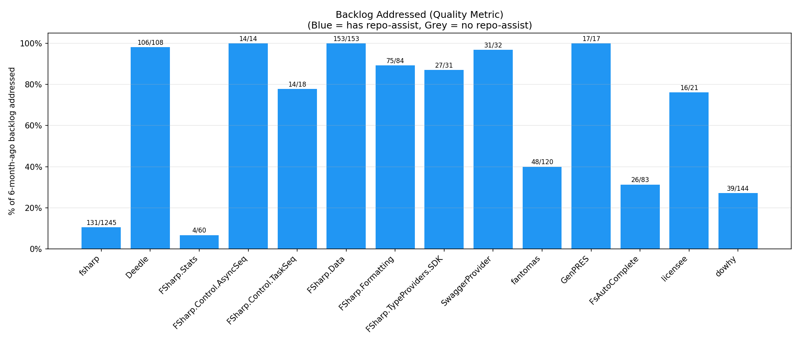
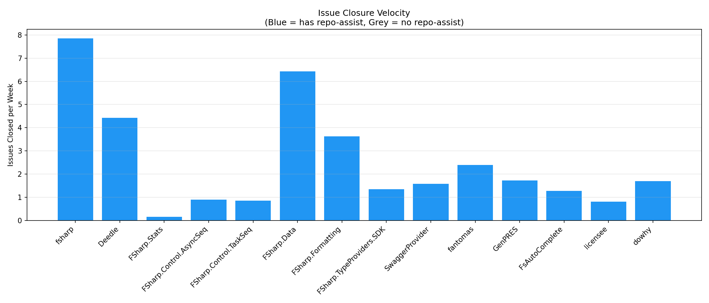
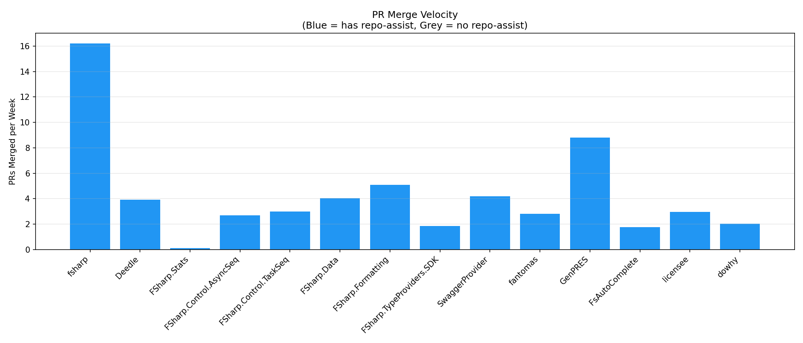
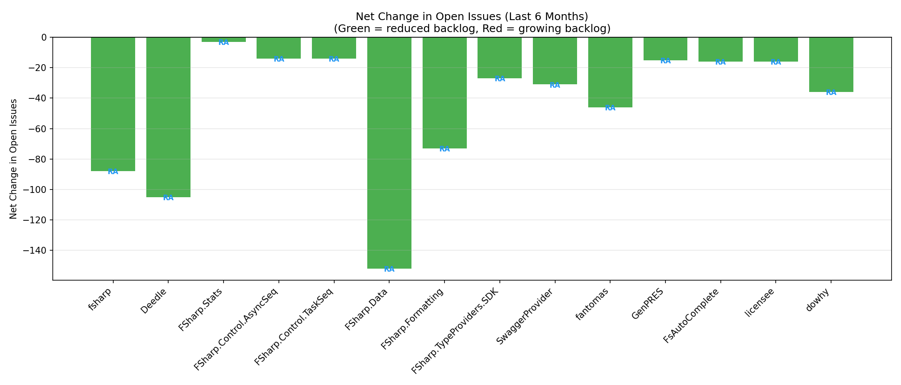
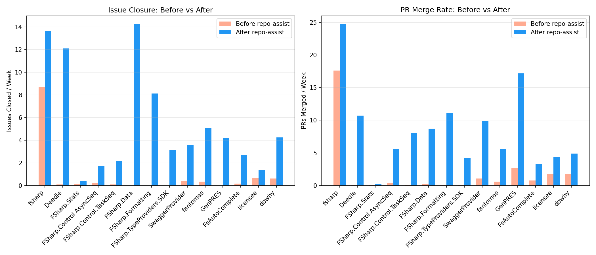

# Repo-Assist Impact Analysis

**Generated**: 2026-05-14 20:47 UTC
**Period**: Last 6 months
**Repositories analyzed**: 15
**With repo-assist**: 15
**Without repo-assist**: 0

## Executive Summary

## Repository Comparison

| Repository | Repo-Assist | Adoption Date | Open 6mo ago | Open Now | Net Change | Backlog Addressed | Issues Closed/wk | PRs Merged/wk |
|---|---|---|---|---|---|---|---|---|
| dotnet/fsharp | Yes | 2026-03-16 | 1246 | 1165 | -81 | 132/1246 (10.6%) | 8.43 | 16.2 |
| fslaborg/Deedle | Yes | 2026-03-08 | 108 | 4 | -104 | 106/108 (98.1%) | 5.58 | 3.93 |
| fslaborg/FSharp.Stats | Yes | 2026-03-23 | 60 | 58 | -2 | 4/60 (6.7%) | 0.46 | 0.12 |
| fsprojects/FSharp.Control.AsyncSeq | Yes | 2026-02-20 | 16 | 2 | -14 | 16/16 (100.0%) | 1.69 | 2.69 |
| fsprojects/FSharp.Control.TaskSeq | Yes | 2026-03-07 | 18 | 6 | -12 | 14/18 (77.8%) | 1.77 | 3.0 |
| fsprojects/FSharp.Data | Yes | 2026-02-21 | 153 | 2 | -151 | 153/153 (100.0%) | 7.97 | 4.04 |
| fsprojects/FSharp.Formatting | Yes | 2026-02-22 | 84 | 12 | -72 | 75/84 (89.3%) | 4.93 | 5.04 |
| fsprojects/FSharp.TypeProviders.SDK | Yes | 2026-02-24 | 31 | 6 | -25 | 27/31 (87.1%) | 2.66 | 1.85 |
| fsprojects/SwaggerProvider | Yes | 2026-03-08 | 32 | 4 | -28 | 31/32 (96.9%) | 2.39 | 4.12 |
| fsprojects/fantomas | Yes | 2026-02-23 | 120 | 75 | -45 | 48/120 (40.0%) | 3.54 | 2.81 |
| informedica/GenPRES | Yes | 2026-02-28 | 17 | 3 | -14 | 17/17 (100.0%) | 1.89 | 8.81 |
| ionide/FsAutoComplete | Yes | 2026-02-22 | 86 | 73 | -13 | 29/86 (33.7%) | 1.77 | 1.77 |
| licensee/licensee | Yes | 2026-03-02 | 21 | 6 | -15 | 16/21 (76.2%) | 1.15 | 2.96 |
| openclaw/openclaw-windows-node | Yes | 2026-03-17 | 0 | 38 | +38 | 0/0 (0.0%) | 3.27 | 7.54 |
| py-why/dowhy | Yes | 2026-03-18 | 144 | 125 | -19 | 39/144 (27.1%) | 1.96 | 2.04 |

## Before/After Repo-Assist Adoption

For repositories with repo-assist, comparing equal-length periods before and after adoption:

| Repository | Adoption | Period (days) | Issues Closed/wk Before | After | Change | PRs Merged/wk Before | After | Change | Backlog at Adoption | Addressed Since |
|---|---|---|---|---|---|---|---|---|---|---|
| dotnet/fsharp | 2026-03-16 | 59 | 8.78 | 14.95 | +6.17 | 17.32 | 24.32 | +7.00 | 1226 | 91 (7.4%) |
| fslaborg/Deedle | 2026-03-08 | 66 | 0.11 | 15.27 | +15.17 | 0.11 | 10.71 | +10.61 | 108 | 106 (98.1%) |
| fslaborg/FSharp.Stats | 2026-03-23 | 52 | 0.13 | 1.48 | +1.35 | 0.13 | 0.27 | +0.13 | 61 | 4 (6.6%) |
| fsprojects/FSharp.Control.AsyncSeq | 2026-02-20 | 82 | 0.60 | 3.16 | +2.56 | 0.34 | 5.63 | +5.29 | 14 | 14 (100.0%) |
| fsprojects/FSharp.Control.TaskSeq | 2026-03-07 | 68 | 0.10 | 4.63 | +4.53 | 0.10 | 7.93 | +7.82 | 18 | 14 (77.8%) |
| fsprojects/FSharp.Data | 2026-02-21 | 82 | 0.00 | 17.67 | +17.67 | 0.26 | 8.71 | +8.45 | 155 | 155 (100.0%) |
| fsprojects/FSharp.Formatting | 2026-02-22 | 81 | 0.00 | 11.06 | +11.06 | 0.09 | 11.15 | +11.06 | 86 | 77 (89.5%) |
| fsprojects/FSharp.TypeProviders.SDK | 2026-02-24 | 78 | 0.00 | 6.19 | +6.19 | 0.09 | 4.22 | +4.13 | 32 | 28 (87.5%) |
| fsprojects/SwaggerProvider | 2026-03-08 | 66 | 0.42 | 5.83 | +5.41 | 1.06 | 9.86 | +8.80 | 32 | 31 (96.9%) |
| fsprojects/fantomas | 2026-02-23 | 80 | 0.35 | 7.70 | +7.35 | 0.61 | 5.60 | +4.99 | 121 | 49 (40.5%) |
| informedica/GenPRES | 2026-02-28 | 75 | 0.00 | 4.57 | +4.57 | 2.71 | 17.17 | +14.47 | 21 | 21 (100.0%) |
| ionide/FsAutoComplete | 2026-02-22 | 81 | 0.43 | 3.54 | +3.11 | 0.78 | 3.20 | +2.42 | 87 | 27 (31.0%) |
| licensee/licensee | 2026-03-02 | 73 | 0.67 | 2.21 | +1.53 | 1.73 | 4.32 | +2.59 | 17 | 12 (70.6%) |
| openclaw/openclaw-windows-node | 2026-03-17 | 58 | 1.45 | 8.81 | +7.36 | 1.21 | 22.45 | +21.24 | 3 | 3 (100.0%) |
| py-why/dowhy | 2026-03-18 | 57 | 0.61 | 5.04 | +4.42 | 1.72 | 4.79 | +3.07 | 142 | 34 (23.9%) |

## Repo-Assist Contribution Details

| Repository | RA PRs Created | RA PRs Merged |
|---|---|---|
| dotnet/fsharp | 0 | 0 |
| fslaborg/Deedle | 100 | 91 |
| fslaborg/FSharp.Stats | 18 | 2 |
| fsprojects/FSharp.Control.AsyncSeq | 69 | 56 |
| fsprojects/FSharp.Control.TaskSeq | 83 | 66 |
| fsprojects/FSharp.Data | 102 | 86 |
| fsprojects/FSharp.Formatting | 118 | 94 |
| fsprojects/FSharp.TypeProviders.SDK | 50 | 45 |
| fsprojects/SwaggerProvider | 69 | 63 |
| fsprojects/fantomas | 64 | 22 |
| informedica/GenPRES | 60 | 60 |
| ionide/FsAutoComplete | 54 | 33 |
| licensee/licensee | 29 | 23 |
| openclaw/openclaw-windows-node | 102 | 74 |
| py-why/dowhy | 61 | 13 |

## Per-Repository Graphs

### dotnet/fsharp
*Repo-assist active since 2026-03-16*

| Metric | Value |
|---|---|
| Open issues (6mo ago → now) | 1246 → 1165 (-81) |
| Backlog addressed | 132/1246 (10.6%) |
| Issues closed/week | 8.43 |
| PRs merged/week | 16.2 |
| New issues/week | 5.31 |

### fslaborg/Deedle
*Repo-assist active since 2026-03-08*

| Metric | Value |
|---|---|
| Open issues (6mo ago → now) | 108 → 4 (-104) |
| Backlog addressed | 106/108 (98.1%) |
| Issues closed/week | 5.58 |
| PRs merged/week | 3.93 |
| New issues/week | 1.58 |

### fslaborg/FSharp.Stats
*Repo-assist active since 2026-03-23*

| Metric | Value |
|---|---|
| Open issues (6mo ago → now) | 60 → 58 (-2) |
| Backlog addressed | 4/60 (6.7%) |
| Issues closed/week | 0.46 |
| PRs merged/week | 0.12 |
| New issues/week | 0.38 |

### fsprojects/FSharp.Control.AsyncSeq
*Repo-assist active since 2026-02-20*

| Metric | Value |
|---|---|
| Open issues (6mo ago → now) | 16 → 2 (-14) |
| Backlog addressed | 16/16 (100.0%) |
| Issues closed/week | 1.69 |
| PRs merged/week | 2.69 |
| New issues/week | 1.15 |

### fsprojects/FSharp.Control.TaskSeq
*Repo-assist active since 2026-03-07*

| Metric | Value |
|---|---|
| Open issues (6mo ago → now) | 18 → 6 (-12) |
| Backlog addressed | 14/18 (77.8%) |
| Issues closed/week | 1.77 |
| PRs merged/week | 3.0 |
| New issues/week | 1.31 |

### fsprojects/FSharp.Data
*Repo-assist active since 2026-02-21*

| Metric | Value |
|---|---|
| Open issues (6mo ago → now) | 153 → 2 (-151) |
| Backlog addressed | 153/153 (100.0%) |
| Issues closed/week | 7.97 |
| PRs merged/week | 4.04 |
| New issues/week | 2.16 |

### fsprojects/FSharp.Formatting
*Repo-assist active since 2026-02-22*

| Metric | Value |
|---|---|
| Open issues (6mo ago → now) | 84 → 12 (-72) |
| Backlog addressed | 75/84 (89.3%) |
| Issues closed/week | 4.93 |
| PRs merged/week | 5.04 |
| New issues/week | 2.16 |

### fsprojects/FSharp.TypeProviders.SDK
*Repo-assist active since 2026-02-24*

| Metric | Value |
|---|---|
| Open issues (6mo ago → now) | 31 → 6 (-25) |
| Backlog addressed | 27/31 (87.1%) |
| Issues closed/week | 2.66 |
| PRs merged/week | 1.85 |
| New issues/week | 1.69 |

### fsprojects/SwaggerProvider
*Repo-assist active since 2026-03-08*

| Metric | Value |
|---|---|
| Open issues (6mo ago → now) | 32 → 4 (-28) |
| Backlog addressed | 31/32 (96.9%) |
| Issues closed/week | 2.39 |
| PRs merged/week | 4.12 |
| New issues/week | 1.31 |

### fsprojects/fantomas
*Repo-assist active since 2026-02-23*

| Metric | Value |
|---|---|
| Open issues (6mo ago → now) | 120 → 75 (-45) |
| Backlog addressed | 48/120 (40.0%) |
| Issues closed/week | 3.54 |
| PRs merged/week | 2.81 |
| New issues/week | 1.81 |

### informedica/GenPRES
*Repo-assist active since 2026-02-28*

| Metric | Value |
|---|---|
| Open issues (6mo ago → now) | 17 → 3 (-14) |
| Backlog addressed | 17/17 (100.0%) |
| Issues closed/week | 1.89 |
| PRs merged/week | 8.81 |
| New issues/week | 1.35 |

### ionide/FsAutoComplete
*Repo-assist active since 2026-02-22*

| Metric | Value |
|---|---|
| Open issues (6mo ago → now) | 86 → 73 (-13) |
| Backlog addressed | 29/86 (33.7%) |
| Issues closed/week | 1.77 |
| PRs merged/week | 1.77 |
| New issues/week | 1.27 |

### licensee/licensee
*Repo-assist active since 2026-03-02*

| Metric | Value |
|---|---|
| Open issues (6mo ago → now) | 21 → 6 (-15) |
| Backlog addressed | 16/21 (76.2%) |
| Issues closed/week | 1.15 |
| PRs merged/week | 2.96 |
| New issues/week | 0.58 |

### openclaw/openclaw-windows-node
*Repo-assist active since 2026-03-17*

| Metric | Value |
|---|---|
| Open issues (6mo ago → now) | 0 → 38 (+38) |
| Backlog addressed | 0/0 (0.0%) |
| Issues closed/week | 3.27 |
| PRs merged/week | 7.54 |
| New issues/week | 4.73 |

### py-why/dowhy
*Repo-assist active since 2026-03-18*

| Metric | Value |
|---|---|
| Open issues (6mo ago → now) | 144 → 125 (-19) |
| Backlog addressed | 39/144 (27.1%) |
| Issues closed/week | 1.96 |
| PRs merged/week | 2.04 |
| New issues/week | 1.23 |

## Comparative Graphs

## Methodology

- **Velocity** is measured as issues closed per week and PRs merged per week over the 6-month analysis period.
- **Quality** is measured as the proportion of the known backlog (open issues 6 months ago) that has been addressed (closed) during the period.
- **Repo-assist detection**: A repository is classified as using repo-assist if it has PRs with `[repo-assist]` in the title or issues/PRs with the `repo-assist` label. The adoption date is the earliest such item.
- **Before/after comparison**: For repos with repo-assist, we compare an equal-length period before adoption to the period after adoption.
- **Limitations**: Correlation does not imply causation. Repos using repo-assist may differ from non-users in maintainer activity, community size, project maturity, and other factors. The before/after comparison within the same repo is more informative than cross-repo comparisons.
