# The Impact of Automated Repository Maintenance Assistance

**Date:** May 14, 2026

**Authors:** Don Syme, Florian Verdonck, Krzysztof Cieślak, Tomas Grosup, Scott Hanselman, Peli de Halleux, Mara Kiefer, Russell Horton, Tamás Szabó, Landon Cox, Alex Gorischek, David Slater, Idan Gazit, Insop Song, Luke Edwards, Maggie Appleton, Nate Butler, Rahul Pandita, Terkel Gjervig Nielsen

**GitHub Next** https://githubnext.com/

## Executive Summary

We analyze the impact of [Repo Assist](https://github.com/githubnext/agentics/blob/main/docs/repo-assist.md), a proactive AI repository agent, across 15 open source repositories that adopted it in 2026. The agent **reduced open issue counts in every repository** - 651 issues net. **Issue closure velocity increased by a median of 9×** and **PR merge velocity by a median of 9×**, transforming largely dormant projects into actively maintained ones.

Our analysis frames repositories as **human-agent software factories** ([SIGPLAN blog post](https://blog.sigplan.org/2026/04/21/repositories-are-human-agent-knowledge-factories/)), applying classical production theory (Theory of Constraints, Little's Law, cycle time analysis) to understand where work flows and where it stalls. The single most important factor is the rate at which maintainers act on the agent's output: throughput is gated by human decision-making. Maintainers pushed additional commits to 37% of Repo Assist PRs, often using secondary agents, while the issue reopen rate after agent-assisted closure is just 3.3%.

Repo Assist runs autonomously on a schedule and in response to events - triaging issues, investigating bugs, creating draft PRs, and responding to questions. Unlike one-shot AI coding assistants, it represents **continuous AI-assisted repository automation**. It is implemented as a [GitHub Agentic Workflow](https://gh.io/gh-aw/), but the findings apply to any repository-level AI automation that produces similar outputs and relies on human review. Results hold across languages (F#, C#, Python, Ruby) and project types (compilers, libraries, tools), though outcomes vary with maintainer engagement, codebase complexity, and social dynamics.

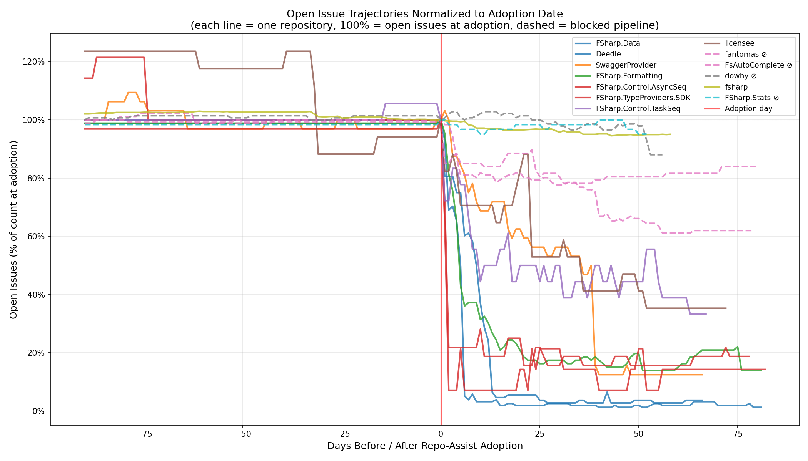

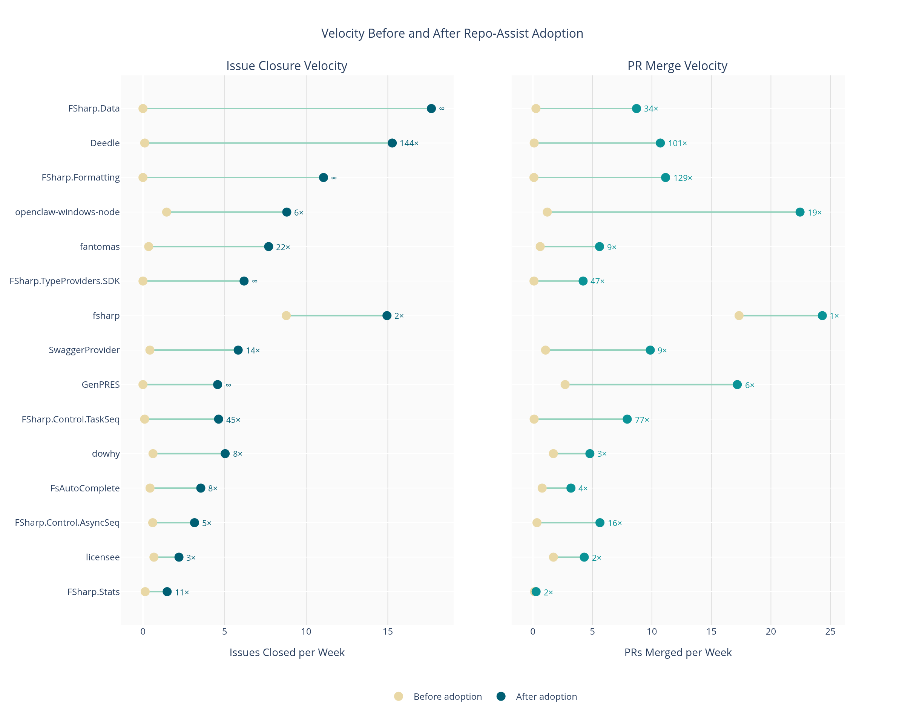

## Measuring the Impact on Velocity: Dormant to Active

In software engineering, *velocity* measures the rate at which a team completes work - here, the number of issues closed per week and PRs merged per week. Velocity is a key indicator of a project's activity: a dormant project has near-zero velocity, while an active one shows sustained throughput.

All 15 repositories show an increase in both issue closure rate and PR merge rate after Repo Assist adoption. The chart below uses a dumbbell plot to visualize the before/after comparison - each arrow shows the magnitude of acceleration for a single repository, with the multiplier on the right. The "before" period is an equal-length window prior to adoption for fair comparison.

The velocity increases are large across the board. The median issue closure velocity increased **9×** (from 0.13 to 3.61 issues/week), and the median PR merge velocity increased **9×** (from 0.34 to 5.63 PRs/week), representing a qualitative shift from dormant or near-dormant repositories to actively-maintained ones. Even the weakest performer (FSharp.Stats, 2× on PRs) shows measurable improvement, though as we will see in the pipeline analysis, that repo's full potential is bottlenecked on human review.

The mean velocity increase is even larger, but the mean is pulled up by a few repositories (Deedle at 114×, FSharp.Formatting at 129× on PRs) that went from essentially zero prior activity to high throughput. The median is a more representative measure of the typical experience. Full per-repository velocity data is available in [Appendix A](#appendix-a-velocity-data).

## Measuring the Impact on Quality: Backlog Reduction

Quality is measured as the proportion of the known backlog (number of open issues at the time of adoption) that has since been addressed. This captures how well the workflow tackles the accumulated debt of unresolved issues. For the purposes of this report, **human-approved AI PRs are assumed to be correct** - when a maintainer reviews and merges a Repo Assist draft PR, that constitutes a human quality judgment, just as it would for any human-authored contribution.

The normalized trajectory chart above shows each repository's open issue count as a percentage of its count at adoption (100% = adoption day), aligned on the x-axis at the adoption date. Repos that achieved near-complete backlog clearance (FSharp.Data, Deedle, AsyncSeq) show curves dropping to near zero. Repos with blocked pipelines (FSharp.Stats, dowhy) show only modest decline.

Full per-repository backlog clearance data is available in [Appendix B](#appendix-b-backlog-clearance-data).

## The Repository as Human-Agent Factory

Why do some repositories achieve near-complete backlog clearance while others barely move? To answer this, we model each repository as a **software factory** - a production system where issues are the raw input, human-agent collaboration is the process, and resolved issues are the output. This factory metaphor is not merely illustrative: it enables the application of well-established production theory to software maintenance.

The [Theory of Constraints](https://en.wikipedia.org/wiki/Theory_of_constraints) (Goldratt, 1984) tells us that the throughput of any production system is determined by its single most constrained resource - the bottleneck. [Little's Law](https://en.wikipedia.org/wiki/Little%27s_law) ($L = \lambda \times W$, where $L$ = work-in-progress, $\lambda$ = arrival rate, $W$ = cycle time) lets us quantify where work accumulates and how long it waits. Together, these tools reveal that the primary driver of low backlog clearance is **where the factory's pipeline is blocked**, not the inherent complexity of the issues.

### A Repository Process Flow Model

Each repository operates as a multi-stage "software factory" with **two distinct output paths**:

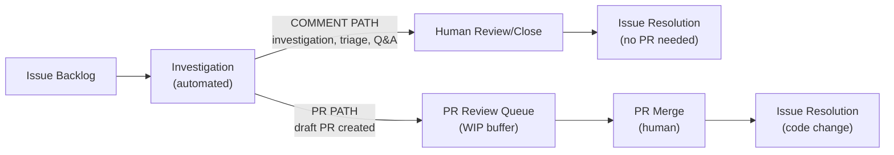
```mermaid
flowchart LR
    A[Issue Backlog] --> B["Investigation\n(automated)"]
    B -->|COMMENT PATH\ninvestigation, triage, Q&A| C["Human Review/Close"]
    C --> D1["Issue Resolution\n(no PR needed)"]
    B -->|PR PATH\ndraft PR created| E["PR Review Queue\n(WIP buffer)"]
    E --> F["PR Merge\n(human)"]
    F --> D2["Issue Resolution\n(code change)"]
```

Repo-assist automates the Investigation stage. For each issue it processes, it produces one of two outputs:

1. **Comment path**: Repo-assist investigates and determines that no code change is needed - the issue is already resolved, is a question that can be answered, or requires only triage. It leaves an investigation comment. A human may then close the issue.
2. **PR path**: Repo-assist determines a code change is needed and creates a draft PR. This enters the review queue where human maintainer action is required.

Both paths contribute to issue resolution. The comment path is a "fast lane" that resolves issues without requiring PR review overhead. Using Little's Law ($L = \lambda \times W$), we analyze where work accumulates in the PR path specifically - the comment path has no WIP buffer since it produces immediate output.

### Repository Flow Status Classification

The repositories fall into four distinct operational states:

**IDLE - Backlog cleared** (FSharp.Data, Deedle, SwaggerProvider, AsyncSeq, GenPRES): Work complete, waiting for new input. These are not constrained - they are **input-starved**.

**FLOWING - Pipeline operating normally** (TaskSeq, FSharp.Formatting, TypeProviders.SDK, licensee, openclaw): Work remains and is being processed at a healthy rate on both paths.

**BLOCKED - Inaction bottleneck** (FSharp.Stats, dowhy): Agent is producing output, but maintainers are not acting on either comments or PRs. WIP grows without bound.

**BLOCKED - Rejection bottleneck** (fantomas): PRs are reviewed promptly but mostly rejected. Three causes (see [Appendix E](#appendix-e-maintainer-notes--fantomas)): holistic judgement requirements, unresolved design discussions treated as actionable, and bandwidth exceeded - leading to monthly cadence reduction.

**BLOCKED - Mixed bottleneck** (FsAutoComplete): Both accumulation and rejection, reflecting a **deliberate capacity constraint** - the maintainer paused the workflow to manage notification pressure, not due to quality concerns (see [Appendix D](#appendix-d-maintainer-notes-fsautocomplete)).

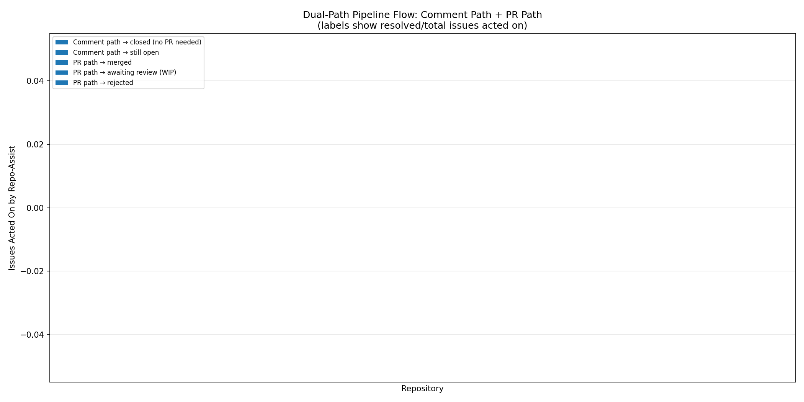

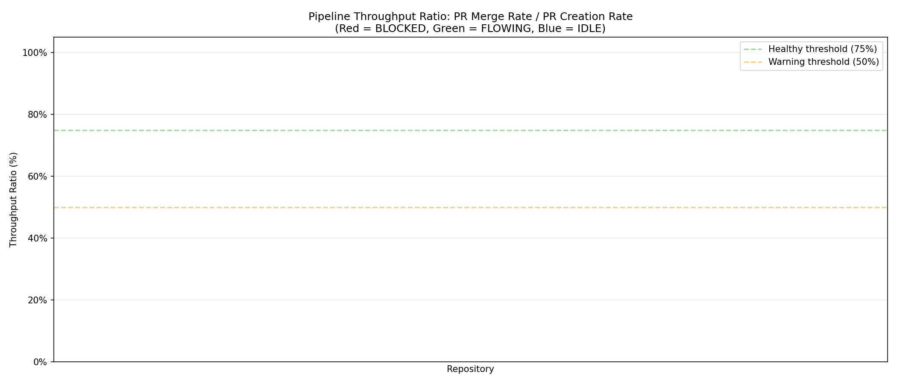

<!-- THROUGHPUT-TABLE-START -->
| Repository | Comment Path (closed/total) | RA PRs | Merged | Rejected | Open (WIP) | PR Throughput | Status |
|---|---|---|---|---|---|---|---|
| fantomas | 28/75 | 64 | 22 | 41 | 1 | **34%** | **BLOCKED** |
| dowhy | 16/87 | 61 | 13 | 5 | 43 | **21%** | **BLOCKED** |
| FsAutoComplete | 27/89 | 54 | 33 | 7 | 14 | **61%** | **BLOCKED** |
| FSharp.Stats | 2/28 | 18 | 2 | 0 | 16 | **11%** | **BLOCKED** |
| FSharp.Formatting | 53/65 | 118 | 94 | 22 | 2 | 80% | FLOWING |
| openclaw | 18/38 | 102 | 74 | 27 | 1 | 73% | FLOWING |
| FSharp.Control.TaskSeq | 12/17 | 83 | 66 | 17 | 0 | 80% | FLOWING |
| FSharp.TypeProviders.SDK | 11/16 | 50 | 45 | 4 | 1 | 90% | FLOWING |
| licensee | 10/16 | 29 | 23 | 5 | 1 | 79% | FLOWING |
| dotnet/fsharp | 54/87 | 0 | - | - | - | - | COMMENT-ONLY |
| FSharp.Data | 108/110 | 102 | 86 | 15 | 1 | 84% | IDLE |
| Deedle | 67/70 | 100 | 91 | 8 | 1 | 91% | IDLE |
| FSharp.Control.AsyncSeq | 7/7 | 69 | 56 | 11 | 2 | 81% | IDLE |
| SwaggerProvider | 26/28 | 69 | 63 | 6 | 0 | 91% | IDLE |
| GenPRES | 27/29 | 60 | 60 | 0 | 0 | **100%** | IDLE |
<!-- THROUGHPUT-TABLE-END -->

Status definitions: **BLOCKED** = pipeline stalled at a specific stage; **FLOWING** = pipeline operating normally with work still to do; **IDLE** = backlog effectively cleared, factory waiting for new input; **COMMENT-ONLY** = using only the investigation/triage path, no PR path.

### Cycle Time Analysis

[Cycle time](https://en.wikipedia.org/wiki/Cycle_time) is the elapsed time from when a work item enters a stage to when it exits. In manufacturing, cycle time directly determines throughput: a machine that takes 10 minutes per part can produce 6 parts per hour. In our software factory, we measure two cycle times: the **merge cycle time** (how long it takes a merged PR to go from creation to merge) and the **open wait time** (how long currently-open PRs have been waiting).

The ratio between these two measures is diagnostic. If open PRs have been waiting much longer than merged PRs took, the remaining open PRs are qualitatively different - they're stuck, not just slow. Full cycle time data is available in [Appendix C](#appendix-c-cycle-time-data).

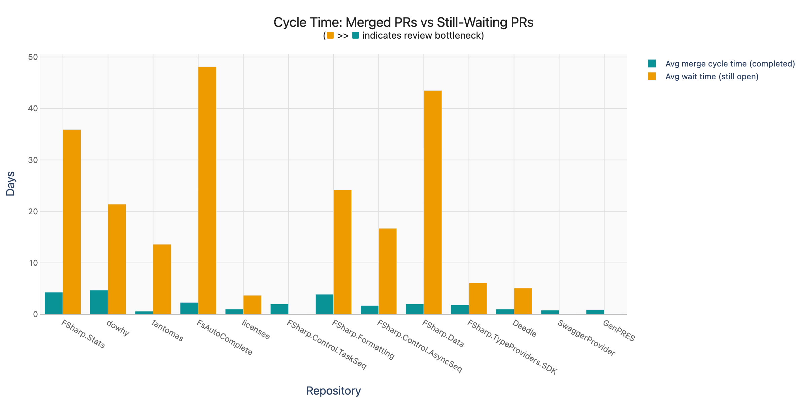

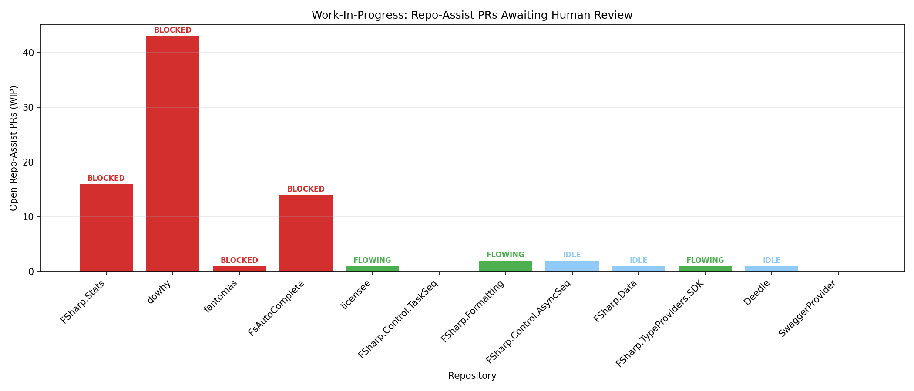

## Human Engagement and Maintainer Override

A key question for any AI-assisted workflow is: how much does a human need to intervene to correct or extend the agent's output? We measure this along several dimensions: directed invocations (human-initiated runs), code-level modifications (additional commits pushed to RA PR branches), use of secondary AI agents (Copilot assign-to-copilot), code review comments, draft-to-ready approvals, and issue reopen rates.

### Directed Invocations

Across all repositories, **30% of active workflow runs are human interventions** (687 of 2,318) - direct `/repo-assist` invocations where a maintainer explicitly asked the agent to work on a specific issue. A further **22% are additional dispatches** (506 runs) where maintainers manually triggered the workflow from the GitHub Actions UI, dialing up the rate of automation beyond the scheduled cadence. Together, **52% of active runs involved some form of human direction**, with the remaining 49% from scheduled automation.

The human intervention rate varies dramatically by repository. Repos with high human intervention rates (FSharp.Formatting: 52%, Deedle: 47%, fantomas: 41%) also tend to have the highest pipeline throughput - suggesting that active human direction of the agent correlates with better outcomes. GenPRES is a notable outlier with 0% human intervention - reflecting its pure work-queue pattern where the maintainer creates issues and lets the scheduled automation handle them.

### Code-Level Modification Rate

Maintainers pushed additional commits (possibly co-authored using local agents) to **328 of 877 RA PR branches (37.4%)**, contributing 650 human commits. Force pushes (which overwrite the agent's code entirely) occurred exactly **once** (0.1%), but regular pushes - adding commits on top of the agent's work - are common. The modification rate varies widely by repository: FSharp.Formatting (54%), licensee (52%), GenPRES (48%), TaskSeq (46%), and Deedle (44%) show the highest rates, while FsAutoComplete (6%), FSharp.Stats (6%), and TypeProviders.SDK (8%) are lowest.

This reveals a more nuanced review dynamic than simple accept-or-reject. In roughly **two-thirds** of RA PRs, maintainers merge the agent's code without modification. But in **over a third**, maintainers are actively building on the agent's work - pushing fixes, extending implementations, or adjusting details before merging. The agent's PRs serve as both finished proposals *and* useful starting points, depending on the issue complexity and maintainer engagement style.

### Use of Secondary Agents

Maintainers also used GitHub Copilot (via assign-to-copilot) to extend RA PR branches, with Copilot commits appearing on **60 of 877 RA PRs (6.8%)** - 115 Copilot commits total. Across all issues (not just RA PRs), **398 unique issues** received `copilot_work_started` events, with 124 of those on RA PRs specifically. This represents a **multi-agent workflow**: Repo Assist creates the initial PR, and maintainers then delegate additional work to Copilot rather than coding manually. SwaggerProvider is the most intensive user (57 RA PRs with Copilot assign, 70 Copilot commits), followed by dowhy (39 RA PRs, 17 commits) and licensee (17 RA PRs, 5 commits).

Copilot also participated as a **code reviewer**: 305 Copilot review comments were left on RA PRs across 7 repositories, compared to 92 human review comments on 54 PRs (6.2%). This suggests some maintainers are using Copilot not just to write additional code but also to review the agent's output - a form of AI-reviewing-AI with human oversight.

### Code Review Comments

Human code review comments (inline PR review comments, not issue comments) were left on **54 of 877 RA PRs (6.2%)** - 92 comments total. The most active reviewers were sergey-tihon (38 comments on SwaggerProvider), nojaf (12 on FSharp.Formatting, 1 on fantomas), dsyme (16 across several repos), and emrekiciman (9 on dowhy). The low rate of human review comments suggests that most RA PRs are evaluated at the whole-PR level (merge or reject) rather than through line-by-line code review - consistent with the draft-to-ready approval pattern.

### Draft-to-Ready Approval

Repo Assist creates PRs as drafts. Before a PR can be merged, a maintainer must explicitly mark it as "ready for review" - a deliberate approval step. Across all repos, **684 of 877 RA PRs (78%) were marked ready by a maintainer**. Of those reviewed (marked ready or explicitly closed), **654 of 795 were merged (82%)**. The remaining 82 open PRs are awaiting review.

### Issue Reopen Rate

Of 671 issues closed after Repo Assist investigation (via the comment path), **22 were subsequently reopened (3.3%)**. This low reopen rate suggests that when RA's investigation leads to issue closure - whether by identifying the issue as already fixed, answering a question, or triaging - the closure is almost always correct. The highest reopen rates were in licensee (25% of 12 closed, 3 reopened) and dotnet/fsharp (11% of 62 closed, 7 reopened), where compiler issue complexity may contribute to premature closures.

### Repo-Specific Norms

Repo Assist does not currently learn or encode repository-specific norms, coding conventions, or maintainer preferences. Its behavior is driven by the repository's code, documentation, and issue context at invocation time, not by accumulated memory of past interactions. This means each invocation starts fresh - the agent does not "learn" from rejected PRs or maintainer feedback. Adding persistent memory of repository norms could potentially reduce the rejection rate (currently 18% of reviewed PRs), particularly in repos like fantomas where domain-specific formatting rules cause high rejection (64%). However, there is also a risk that encoding maintainer preferences creates hidden policy that is difficult to audit or override.

A related limitation is **issue readiness**: the agent treats every open issue as potentially actionable, but some issues - particularly in fantomas - represent unresolved design discussions, behavioural trade-offs, or differing opinions between maintainer and reporter. As the fantomas maintainer notes (see [Appendix E](#appendix-e-maintainer-notes--fantomas)), "an open issue is not necessarily a green light for implementation." A mechanism for maintainers to signal issue readiness (e.g. labels, issue types, or explicit opt-in) could reduce wasted work on issues that are unlikely to produce mergeable PRs.

## Social Factors in the Software Factory

Like all automation technologies, successful use of agentic repository automation is driven by human-social factors. The creator of Repo Assist (@dsyme) was a maintainer and community leader in the adopting community, clearly influencing adoption rates. Repositories with active maintainers who feel empowered to act and seek forward velocity are more likely to see better outcomes.

Two maintainers explicitly cited **automation fatigue**. The FsAutoComplete maintainer cited **notification anxiety** and disabled the workflow during reduced bandwidth. The fantomas maintainer described the workflow becoming "too noisy" and reduced cadence to monthly. Both illustrate that continuous AI automation can amplify maintenance pressure even when output is high quality. The ability to **control the rate of automation** is crucial - maintainers should be able to match production rate to their available bandwidth.

Most repositories in this analysis were "dormant" at adoption, meaning **there was no significant human-to-human collaboration to impact**. However, automated AI can be corrosive on social platforms and this should be considered before adopting AI automation in non-dormant repositories.

## Per-Repository Detail

### fsprojects/FSharp.Data
*Adopted 2026-02-21 · Factory IDLE (backlog cleared)*

Went from 153 open issues to just 1 - a complete backlog clearance. Issue closure rate went from 0.00/week to 14.26/week. This suggests a large proportion of FSharp.Data's backlog was well-specified, fixable bugs and features that were simply waiting for someone to address them.

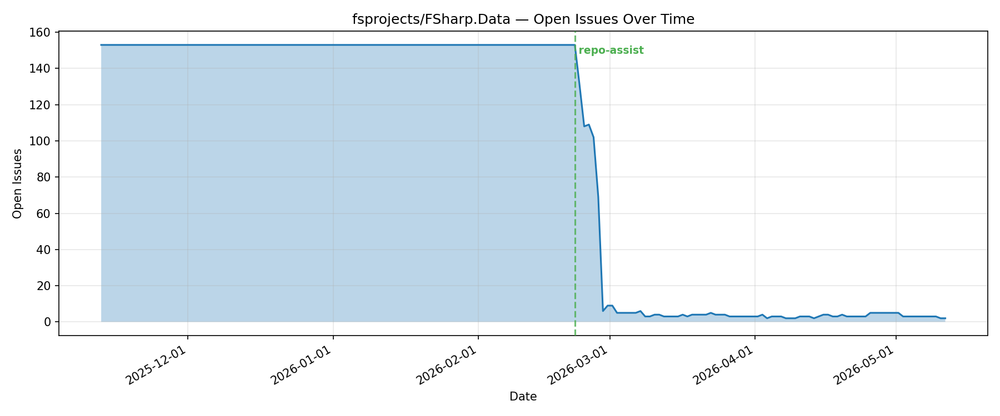
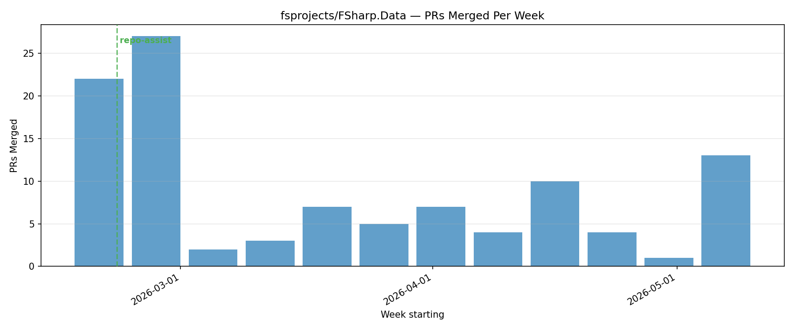

### fslaborg/Deedle
*Adopted 2026-03-08 · Factory IDLE (backlog cleared)*

108 open issues reduced to 3. Adoption was slightly later but the rate of closure was the highest of all repos at 12/week. Nearly all legacy backlog addressed.

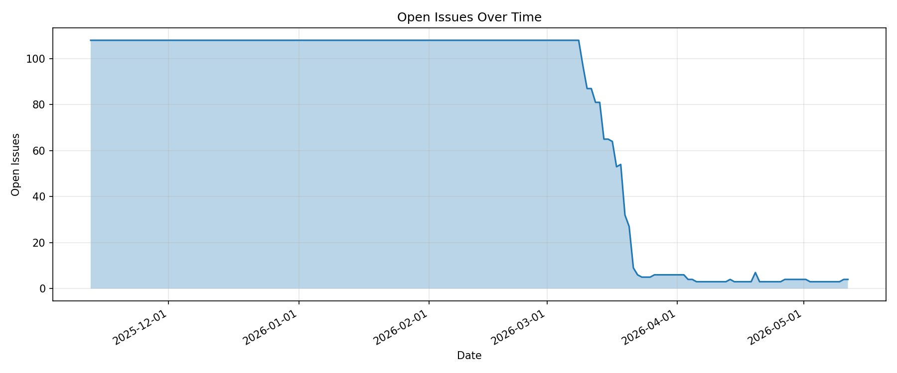
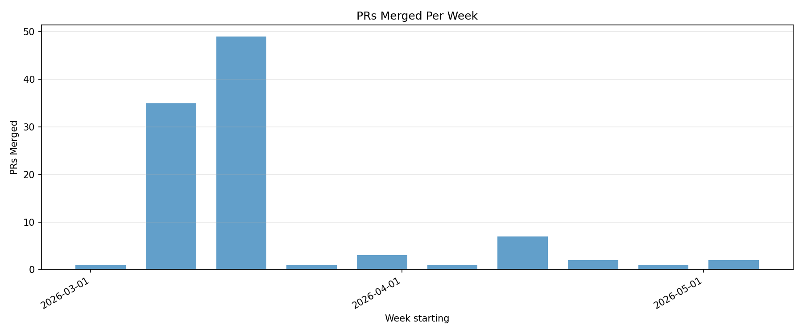

### fsprojects/SwaggerProvider
*Adopted 2026-03-08 · Factory IDLE (backlog cleared)*

32 → 1 open issues (96.9% backlog clearance). Particularly notable for high PR merge velocity - 9.86 PRs/week after adoption, the highest of any non-GenPRES repo. This repo had low prior activity (1.06 PRs merged/week before adoption).

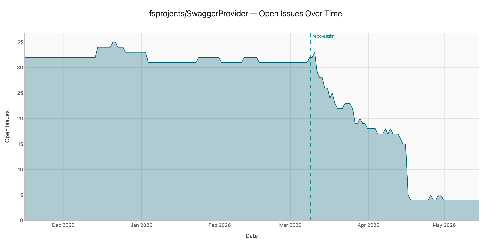
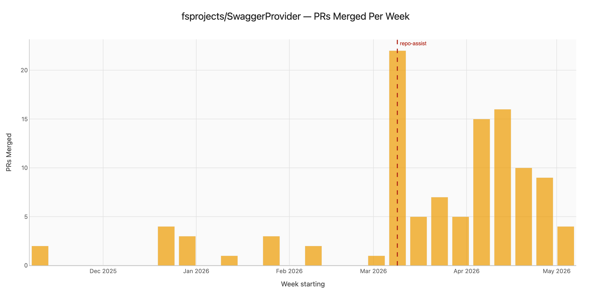

### fsprojects/FSharp.Formatting
*Adopted 2026-02-22 · Factory FLOWING*

85 → 11 open issues. Both issue closure and PR merge rates exceeded 8/week after adoption. Zero pre-adoption activity in the comparison period makes the contrast especially stark.

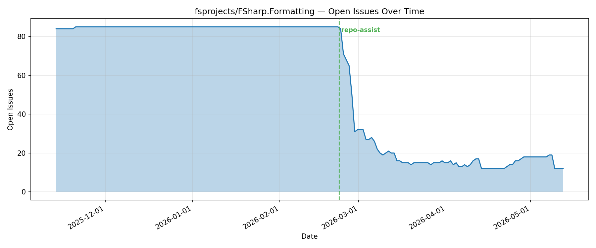
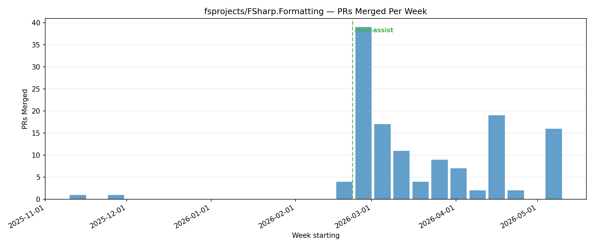

### fsprojects/fantomas
*Adopted 2026-02-23 · Pipeline BLOCKED (rejection)*

120 → 74 open issues. A **rejection bottleneck**: maintainers reject 64% of PRs (41 of 64), though the WIP queue stays low (1 PR, 0.6d merge cycle) - PRs are processed promptly, they just don't meet the codebase's standards. On the comment path, 28 of 75 investigated issues were closed. The workflow **did rekindle engagement** - the maintainer reports a "renewed spark" - but the high rejection rate reflects: (1) formatting requires holistic judgement that tests alone cannot capture; (2) some open issues are unresolved design discussions, not actionable tasks; (3) the automation's output exceeded available attention. The maintainer reduced to monthly cadence rather than disabling entirely (see [Appendix E](#appendix-e-maintainer-notes--fantomas)).

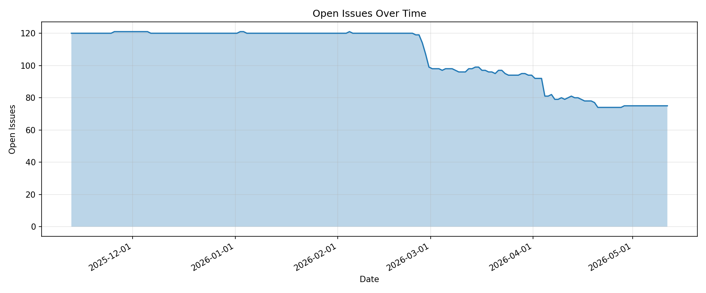
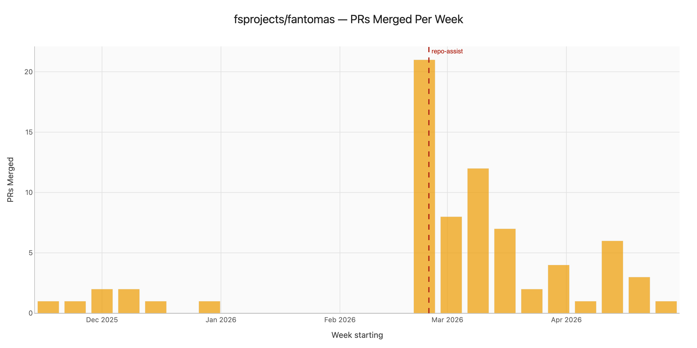

### py-why/dowhy
*Adopted 2026-03-18 · Pipeline BLOCKED (inaction)*

142 → 108 open issues. Despite issue closure jumping from 0.62 to 4.25/week, the pipeline is severely constrained on both paths: on the PR path, 43 of 61 PRs (70%) remain in the review queue with an average wait of 18.2 days; on the comment path, only 16 of 87 investigated issues were closed. The arrival rate of 1.15 PRs/day exceeds the departure rate of 0.25 PRs/day by 4.7:1. As a Python causal inference library with 8,100+ stars, it validates that Repo Assist works across ecosystems - but its full potential is bottlenecked on maintainer engagement with both the agent's PRs and investigation comments.

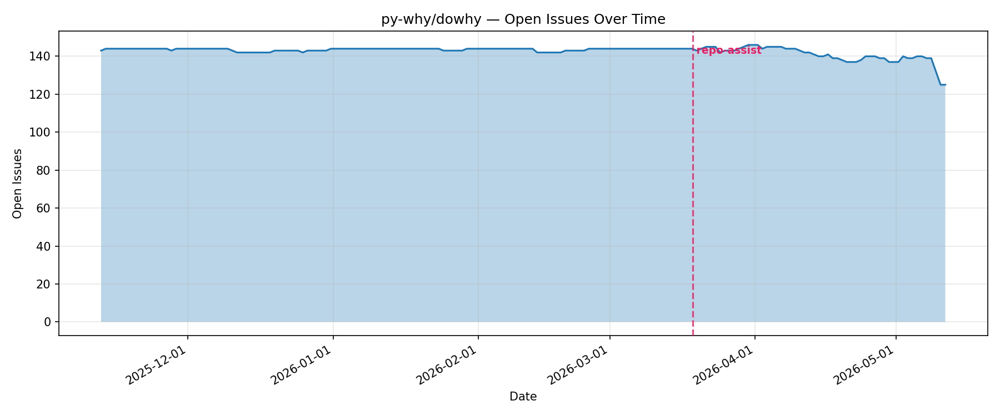
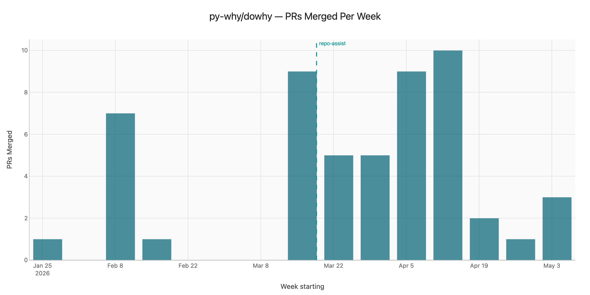

### ionide/FsAutoComplete
*Adopted 2026-02-22 · Pipeline BLOCKED (mixed) · Workflow paused by maintainer*

86 → 67 open issues. A **mixed bottleneck**: 14 PRs in review queue (avg wait 44.9 days, longest of any repo), 7 rejected, 61% PR throughput ratio. However, the merged PRs are **high quality** - 33 merged in ~2 months, equivalent to 62% of the repository's entire 2025 output, with comprehensive integration tests. Some rejected PRs were **intentionally experimental**. The maintainer **chose to disable the workflow** to manage notification pressure during reduced bandwidth - not dissatisfaction with output - and intends to re-enable when capacity returns (see [Appendix D](#appendix-d-maintainer-notes-fsautocomplete)).

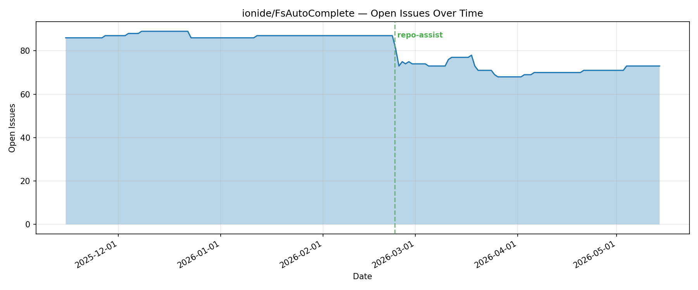
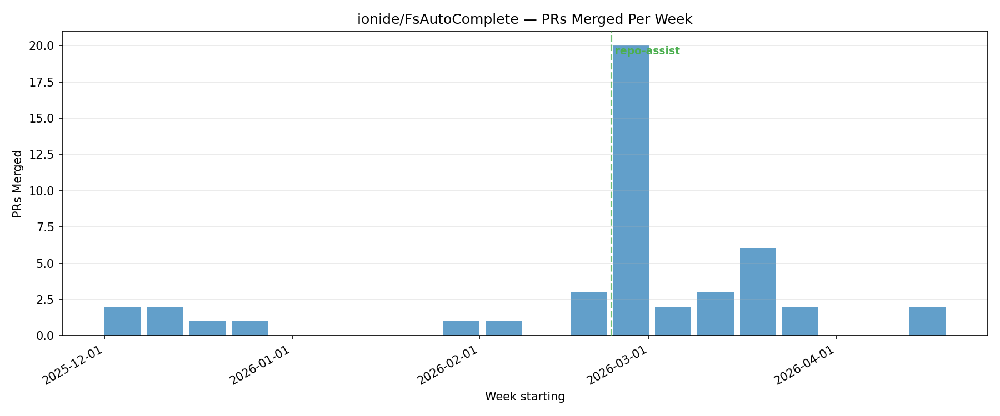

### fsprojects/FSharp.Control.TaskSeq
*Adopted 2026-03-07 · Factory FLOWING*

18 → 4 open issues, with one of the highest PR merge rates at 8.04/week. The workflow found many opportunities for contribution in this actively-developed library.

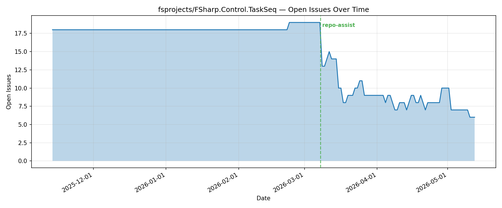

### fsprojects/FSharp.Control.AsyncSeq
*Adopted 2026-02-20 · Factory IDLE (backlog cleared)*

12 → 0 open issues. 100% of the pre-adoption backlog addressed. Small repo where the workflow was able to comprehensively address all outstanding issues.

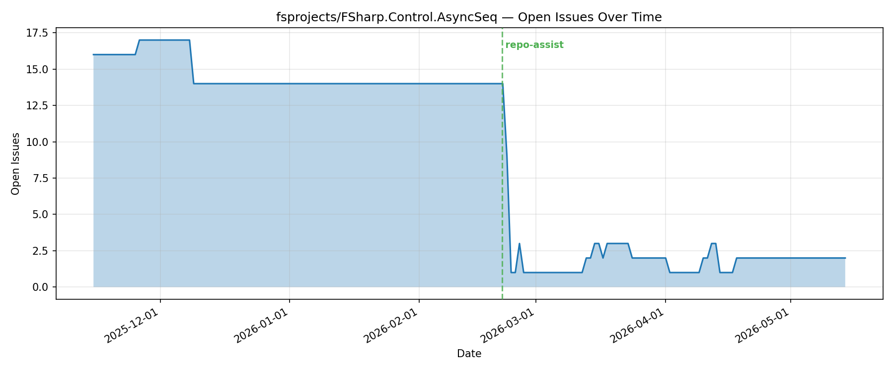

### fsprojects/FSharp.TypeProviders.SDK
*Adopted 2026-02-24 · Factory FLOWING*

31 → 4 open issues (87.1% backlog clearance). Good result for a project that had seen no issue closures in the comparison period before adoption.

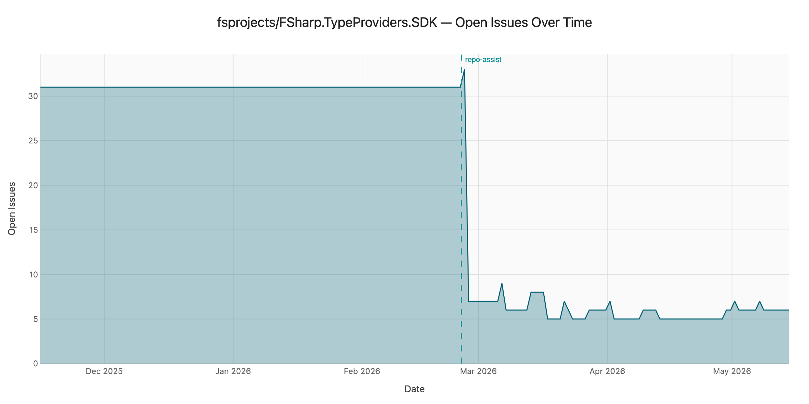

### fslaborg/FSharp.Stats
*Adopted 2026-03-23 · Pipeline BLOCKED (inaction)*

60 → 57 open issues. While this is the most recently adopted repo, the low clearance (5%) is **not primarily due to recency** - it is due to an inaction bottleneck on **both** output paths. On the PR path, Repo Assist has created 18 PRs, but only 2 have been merged; the remaining 16 sit in the review queue with an average wait of 32.8 days. On the comment path, Repo Assist investigated 28 issues, but only 2 were closed - maintainers are not acting on the agent's triage output either. The pipeline throughput ratio is just 11% - the lowest of all repositories.

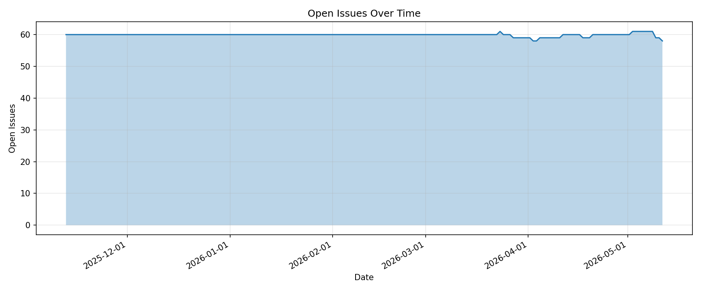

### licensee/licensee
*Adopted 2026-03-02 · Factory FLOWING*

16 → 5 open issues (69% backlog clearance). A Ruby gem for open source license detection with 881 stars - validating that Repo Assist works across language ecosystems. On the PR path, 23 of 29 PRs merged (79% throughput) with a fast 1.0d average merge cycle. On the comment path, 10 of 16 investigated issues were closed. Maintainers are actively reviewing and merging - the pipeline is flowing well with low WIP (1 open PR).

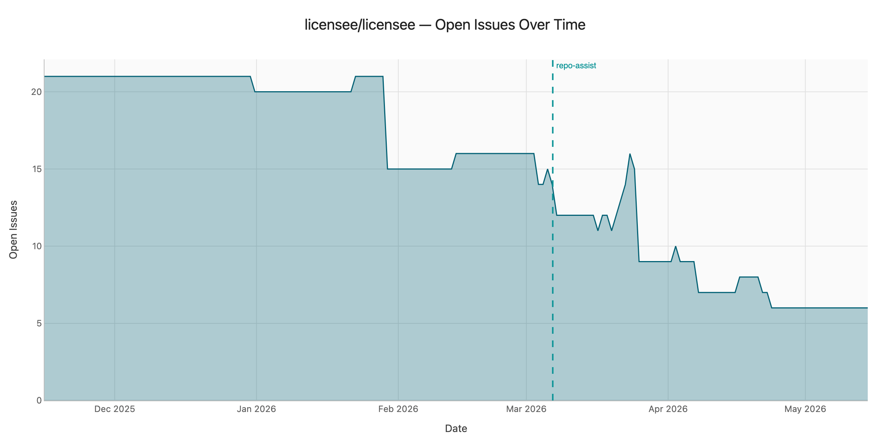
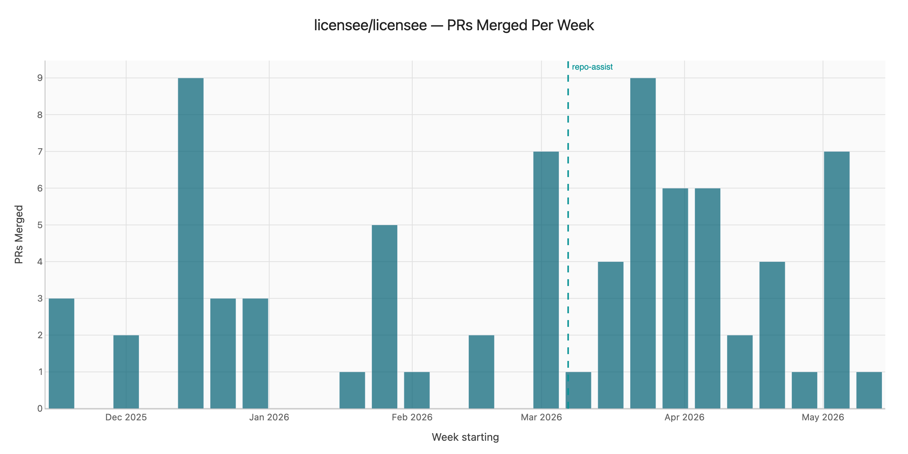

### openclaw/openclaw-windows-node
*Adopted 2026-03-17 · Factory FLOWING*

A C# application (518 stars) validating cross-ecosystem applicability. Had only 3 open issues at adoption but rapidly grew: 123 new issues in 8 weeks (4.73 new/week). Repo Assist created 102 PRs, 74 merged (73% throughput), merge cycle 2.8 days. Velocity increase: issues 1.45 → 8.81/week (6×), PRs 1.21 → 22.45/week (19×). Follows a primarily automated pattern (118 of 121 runs scheduled) with minimal human direction.

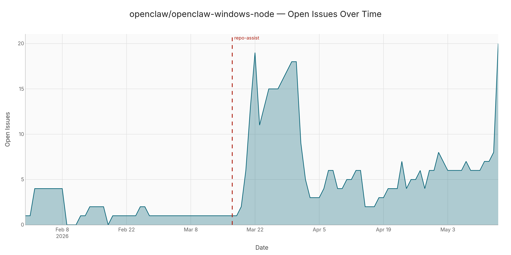
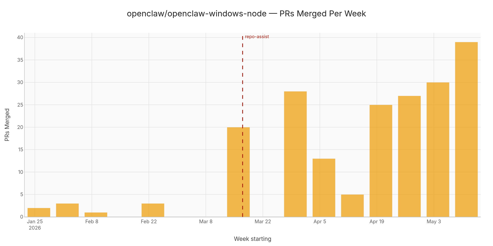

### dotnet/fsharp
*Adopted 2026-03-16 · Comment-path only*

The F# compiler and core tooling repository - a large, actively maintained project with 6,700+ issues and a pre-existing closure rate of 8.69/week. Unlike the other repos, it was already a functioning software factory. Repo Assist was deployed in a **comment-path-only configuration**, focused on investigating and triaging old issues. No PRs were created.

**Results:** 1,225 → 1,157 open issues (−68 net, 7% backlog clearance). Of 87 investigated issues, 54 were closed by maintainers (62% comment-path closure rate). Issue closure velocity increased to 13.64/week - a **1.6× increase**. The 62% closure rate sits between well-flowing repos (93–100%) and blocked repos (7–20%), likely reflecting the higher complexity of compiler issues.

This demonstrates that the comment-path function provides value even in large, actively maintained repositories - the agent serves as a **backlog triage assistant**, systematically working through old issues that maintainers may never get to.

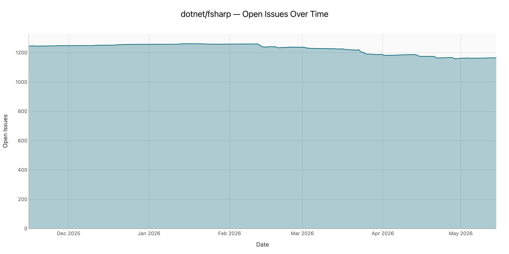

### informedica/GenPRES
*Adopted 2026-02-28 · Factory IDLE (backlog cleared) · Work queue pattern*

An F# medical software project representing a distinct usage pattern: the maintainer created issues as desired work items and let Repo Assist process them - the agent as **production assistant** rather than backlog reducer.

**Results:** 19 → 2 open issues (100% clearance). All 60 PRs merged - 100% throughput ratio, highest of any repo. Merge cycle 0.9 days. PR velocity went from 2.71/week to 17.17/week (6×). The workflow was almost entirely automated (77 of 78 runs scheduled, 0 human interventions) - the maintainer created issues and let scheduled runs process them.

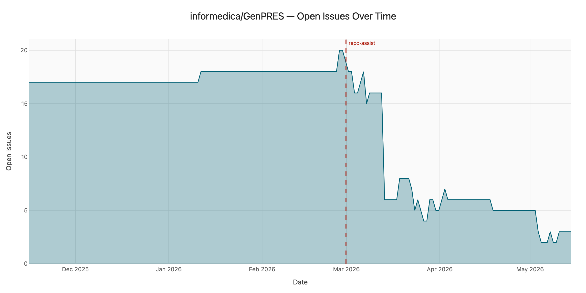
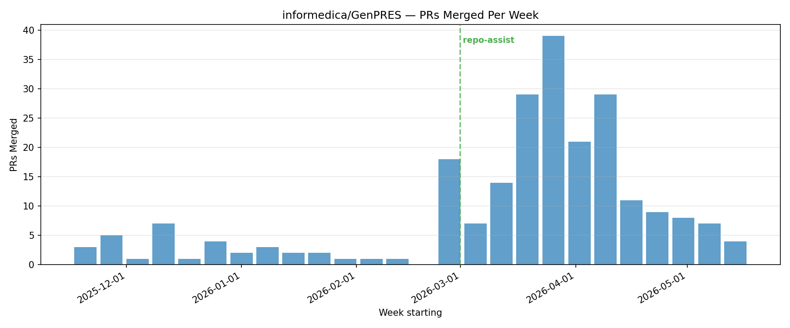

## Workflow Invocation Analysis

Repo Assist workflow runs fall into three categories:

- **Automated (scheduled)**: Periodic runs on a cron schedule - the factory's own clock.
- **Automated (additional)**: Manual dispatch from the GitHub Actions UI - where a maintainer explicitly dialed up the rate of automation beyond the scheduled cadence.
- **Human intervention (/repo-assist)**: Event-triggered runs that actually executed - issue comments, PR review comments, issue events, and PR events that passed the workflow's pre-activation check. These represent actual `/repo-assist` invocations where a human triggered the agent to investigate a specific issue.

Full per-repository invocation data is available in [Appendix F](#appendix-g-workflow-invocation-data).

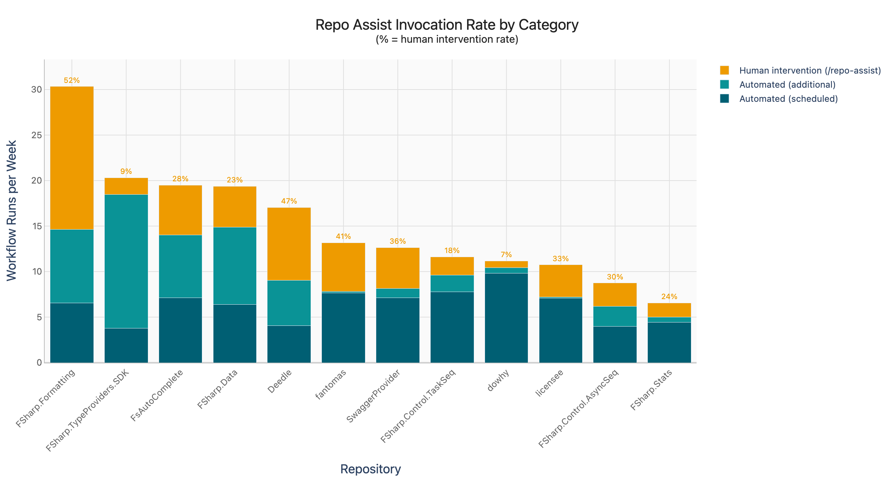

## Methodology

- **Velocity** is measured as issues closed per week and PRs merged per week. The "before" period is an equal-length window before the adoption date; "after" is from adoption to now.
- **Quality (backlog clearance)** is the proportion of issues that were open at the time of Repo Assist adoption that have since been closed. This measures how well accumulated technical and feature debt is being addressed.
- **Repo-assist detection**: A repository is classified as using repo-assist based on PRs with `[repo-assist]` in the title or issues/PRs with the `repo-assist` label. The adoption date is the earliest such item.
- **Inclusion criteria**: Repos were included only if (a) repo-assist workflow runs have succeeded in the last week, and (b) adoption was more than 3 weeks ago.
- **Bot issue exclusion**: Issues created by `github-actions[bot]` are excluded from all counting and analysis (backlog metrics, velocity, incoming rates). These include monthly activity reports, failure notifications, and other automated outputs that would inflate issue counts. Bot issues are *not* excluded from adoption date detection, since they signal when Repo Assist was deployed.
- **Limitations**: This analysis measures correlation, not strict causation. The adoption of Repo Assist may have coincided with increased human maintainer activity. However, the consistency of the pattern across all 15 repositories - and the near-zero baseline activity in many repos before adoption - strongly suggests Repo Assist is the primary driver. The non-F# repos (dowhy, licensee, openclaw) provide cross-ecosystem validation.
- **Issue quality caveat**: Some closed issues may have been closed as "won't fix" or triaged rather than fixed. The current analysis counts all closures equally. A more nuanced analysis could distinguish closure reasons.
- **Pipeline bottleneck analysis**: Models the repository as a multi-stage human-agent software factory. Uses Little's Law ($L = \lambda W$) to compute implied cycle times and identify WIP accumulation. Throughput ratio (PRs merged / PRs created) is the primary bottleneck metric. Bottleneck types are classified as: INACTION (high WIP, low review activity), REJECTION (high rejection rate, low WIP), or MIXED (both). Status levels: BLOCKED (score ≥5), FLOWING (0), IDLE (≤5 open issues and ≤2 open PRs with no bottleneck).
- **Workflow invocation analysis**: Uses the GitHub Actions API to retrieve all workflow runs. 60% of all runs (3,429 of 5,747) were immediately skipped or cancelled and are excluded. Only *active* runs are counted, classified as: *Automated (scheduled)*, *Automated (additional)* (manual dispatch), or *Human intervention (/repo-assist)* (event-triggered runs that passed pre-activation).
- **Dual-path model**: Bot comments detected via `github-actions[bot]` comments containing "automated response from Repo Assist". PR-path issues identified by comments mentioning "Pull request created". Comment-path issues are those closed without a PR.
- **Maintainer override analysis**: Commit lists fetched for all 877 RA PRs. Commits by `github-actions[bot]`, `web-flow`, or `actions-user` classified as bot; by `Copilot` as agent commits; all others as human pushes. Force pushes detected via `head_ref_force_pushed` events. Review comments classified by author (bot/Copilot/human). Draft-to-ready measured via `ready_for_review` events. Reopen rate measured via `reopened` events on RA-investigated issues.

## Data & Scripts

All data and scripts used in this analysis are available in this repository:

- `scripts/download-github-data.sh` - Generic script to download issues, PRs, and events for any GitHub repo
- `scripts/download-all.sh` - Batch download for all analyzed repos
- `scripts/graph-repo-stats.py` - Per-repo graph generation (open issues over time, merge rate, PR time-to-merge, issue activity)
- `scripts/generate-all-graphs.sh` - Batch graph generation
- `scripts/analyze-repo-assist.py` - Cross-repo analysis, comparative graphs, and report generation
- `scripts/bottleneck-analysis.py` - Pipeline flow analysis using Theory of Constraints and Little's Law; bottleneck identification and classification
- `scripts/normalized-graph.py` - Normalized open-issue trajectory graph aligned to adoption date
- `scripts/invocation-analysis.py` - Workflow invocation rate analysis by trigger type (filters out skipped runs)
- `scripts/velocity-graph.py` - Velocity dumbbell chart (before/after comparison)
- `scripts/generate-tables.py` - Auto-generates appendix tables (throughput, invocations) from analysis JSON
- `scripts/download-workflow-runs.sh` - Download GitHub Actions workflow run data
- `data/` - Raw JSON data for all repositories (including `workflow-runs.json` per repo)
- `graphs/` - All generated PNG graphs

---

## Appendices

### Appendix A: Velocity Data

| Repository | Adopted | Period | Issues Closed/wk Before | After | Δ | PRs Merged/wk Before | After | Δ |
|---|---|---|---|---|---|---|---|---|
| fsprojects/FSharp.Data | 2026-02-21 | 82d | 0.00 | 14.26 | **+14.26** | 0.26 | 8.71 | **+8.45** |
| fslaborg/Deedle | 2026-03-08 | 66d | 0.11 | 12.09 | **+11.98** | 0.11 | 10.71 | **+10.61** |
| fsprojects/FSharp.Formatting | 2026-02-22 | 81d | 0.00 | 8.12 | **+8.12** | 0.09 | 11.15 | **+11.06** |
| fsprojects/fantomas | 2026-02-23 | 80d | 0.35 | 5.08 | **+4.73** | 0.61 | 5.60 | **+4.99** |
| informedica/GenPRES | 2026-02-28 | 75d | 0.00 | 4.20 | **+4.20** | 2.71 | 17.17 | **+14.47** |
| py-why/dowhy | 2026-03-18 | 56d | 0.62 | 4.25 | **+3.63** | 1.75 | 4.88 | +3.12 |
| fsprojects/SwaggerProvider | 2026-03-08 | 66d | 0.42 | 3.61 | **+3.19** | 1.06 | 9.86 | **+8.80** |
| fsprojects/FSharp.TypeProviders.SDK | 2026-02-24 | 78d | 0.00 | 3.14 | **+3.14** | 0.09 | 4.22 | **+4.13** |
| ionide/FsAutoComplete | 2026-02-22 | 80d | 0.17 | 2.71 | +2.54 | 0.79 | 3.24 | +2.45 |
| fsprojects/FSharp.Control.TaskSeq | 2026-03-07 | 67d | 0.10 | 2.19 | **+2.09** | 0.10 | 8.04 | **+7.94** |
| fsprojects/FSharp.Control.AsyncSeq | 2026-02-20 | 82d | 0.26 | 1.71 | +1.45 | 0.34 | 5.63 | **+5.29** |
| licensee/licensee | 2026-03-02 | 73d | 0.67 | 1.34 | +0.67 | 1.73 | 4.32 | +2.59 |
| fslaborg/FSharp.Stats | 2026-03-23 | 52d | 0.13 | 0.40 | +0.27 | 0.13 | 0.27 | +0.13 |
| openclaw/openclaw-windows-node | 2026-03-17 | 58d | 1.45 | 8.81 | **+7.36** | 1.21 | 22.45 | **+21.24** |
| dotnet/fsharp † | 2026-03-16 | 58d | 8.69 | 13.64 | +4.95 | 17.62 | 24.74 | +7.12 |
| **Average (excl. dotnet/fsharp)** | | | **0.22** | **4.85** | **+4.63** | **0.75** | **7.22** | **+6.47** |
| **Median (excl. dotnet/fsharp)** | | | **0.13** | **3.61** | | **0.34** | **5.63** | |

† dotnet/fsharp is excluded from the Average and Median rows. Unlike the other repositories, it was already actively maintained before adoption (8.69 issues/wk, 17.62 PRs/wk). It used Repo Assist in a comment-path-only configuration with no RA PRs; the PR velocity change is not attributable to Repo Assist.

### Appendix B: Backlog Clearance Data

| Repository | Open at Adoption | Addressed Since | Backlog Clearance | Open Now | Net Change |
|---|---|---|---|---|---|
| fsprojects/FSharp.Data | 153 | 153 | **100.0%** | 1 | −152 |
| fsprojects/FSharp.Control.AsyncSeq | 12 | 12 | **100.0%** | 0 | −12 |
| informedica/GenPRES | 19 | 19 | **100.0%** | 2 | −17 |
| fslaborg/Deedle | 108 | 106 | **98.1%** | 3 | −105 |
| fsprojects/SwaggerProvider | 32 | 31 | **96.9%** | 1 | −31 |
| fsprojects/FSharp.Formatting | 85 | 76 | **89.4%** | 11 | −74 |
| fsprojects/FSharp.TypeProviders.SDK | 31 | 27 | **87.1%** | 4 | −27 |
| fsprojects/FSharp.Control.TaskSeq | 18 | 14 | **77.8%** | 4 | −14 |
| licensee/licensee | 16 | 11 | **68.8%** | 5 | −11 |
| fsprojects/fantomas | 120 | 48 | 40.0% | 74 | −46 |
| ionide/FsAutoComplete | 87 | 27 | 31.0% | 67 | −20 |
| py-why/dowhy | 142 | 34 | 23.9% | 108 | −34 |
| dotnet/fsharp † | 1225 | 90 | 7.3% | 1157 | −68 |
| fslaborg/FSharp.Stats | 60 | 3 | 5.0% | 57 | −3 |
| openclaw/openclaw-windows-node | 3 | 3 | **100.0%** | 38 | +35 |
| **Total (excl. dotnet/fsharp)** | **886** | **564** | **63.7%** | **375** | **−511** |
| **Total (all 15 repos)** | **2111** | **654** | **31.0%** | **1532** | **−579** |

† dotnet/fsharp's large issue count (1,225 at adoption) significantly shifts the aggregate backlog clearance percentage. The separate totals show the impact with and without this outlier. openclaw shows a net increase in open issues despite 100% adoption-backlog clearance, because rapid issue creation (123 new issues in 8 weeks) outpaced closure.

### Appendix C: Cycle Time Data

| Repository | Avg Merge Cycle | Avg Open Wait | Wait/Merge Ratio | Status |
|---|---|---|---|---|
| FSharp.Stats | 4.3d | 32.8d | **7.6×** | BLOCKED (inaction) |
| dowhy | 4.7d | 18.3d | **3.9×** | BLOCKED (inaction) |
| FsAutoComplete | 2.3d | 44.9d | **19.5×** | BLOCKED (mixed) |
| fantomas | 0.6d | 10.5d | **17.5×** | BLOCKED (rejection) |
| FSharp.Formatting | 3.9d | 21.1d | 5.4× | FLOWING |
| FSharp.Data | 2.0d | 40.4d | 20.2× | IDLE |
| Deedle | 1.0d | 2.0d | 2.0× | IDLE |
| SwaggerProvider | 0.8d | 0.0d | - | IDLE |
| TypeProviders.SDK | 1.8d | 3.0d | 1.7× | FLOWING |
| AsyncSeq | 1.7d | 13.6d | 8.0× | IDLE |
| TaskSeq | 2.0d | 0.0d | - | FLOWING |
| licensee | 1.0d | 0.7d | 0.7× | FLOWING |
| openclaw | 2.8d | 0.3d | 0.1× | FLOWING |
| GenPRES | 0.9d | 0.0d | - | IDLE |

### Appendix D: Maintainer Notes - FsAutoComplete

The following are lightly edited notes from the FsAutoComplete maintainer (Krzysztof Cieślak), providing qualitative context for the quantitative analysis above.

> FSAC is an interesting case. Couple of notes related to it:
>
> * The repository is not really actively maintained at all [there's new release every few months, and development is not really active]
> * Enabling Repo Assist definitely created a surge in activity - in ~2 months it was active we merged almost as much (probably could get exact numbers here easily) PRs as in whole 2025 year (and I'd say that many of Repo Assist PRs were more impactful)
> * Due to the type of software it is, there's certain level of code complexity + potential huge impact on the ecosystem if something goes wrong. Which means it requires rather careful reviews
> * In general I'm very happy with most PRs I merged - there are high quality, useful, meaningful, follows best practices of the repository [like adding a lot of integration tests for new features]
> * Some of the open PRs, at glance, looks good, but as I've mentioned they need more review...
> * Some of the non-merged PRs were very specifically prompted to be an experiments / "check if this old bug is still happening" type of things. They would require more follow-up, and maybe some of them should be just closed.
> * But I just don't have a time (nor I'm in the right mindset at the moment) to review stuff - this has nothing to do with Repo Assist on its own, but with me. Maintaining OSS has not been the highest priority for a while, due to various reasons related to both professional and personal life. 
> * Which resulted in me disabling the workflow (= reducing its production rate to zero) - but when I'll have more spare time / better mindset for FSAC work, I'll 100% enable again.
> * Keeping it enabled while I didn't had time created a bit of "notification anxiety" thing, that probably many of maintainers know well - you know, you wake up, open GH and see whole bunch of notifications, and you're like "oh no my life sucks"

### Appendix E: Maintainer Notes - fantomas

The following are lightly edited notes from the fantomas maintainer (Florian Verdonck / @nojaf), providing qualitative context for the high rejection rate observed in that repository.

> A few observations from using repo-assist on Fantomas:
>
> 1. **It did rekindle some engagement.** Repo-assist genuinely gave me a renewed spark with Fantomas for a while. That part was real. But over time it became a bit too noisy relative to the amount of attention I want to give that project right now. Fantomas is not my main focus these days, so I reduced the frequency of repo-assist interactions to monthly. Eventually the value wore off more because of that mismatch than because of any one specific failure mode.
>
> 2. **Fantomas is a difficult target because many fixes need broader judgement.** For a formatter, a change can fix one reported case while moving the implementation in a direction that is not actually desirable overall, or by breaking other cases. Sometimes tests catch that, sometimes they do not, and sometimes you can simply tell the fix is too specific or not in the right spirit even if the tests pass. In those cases, it was often easier to close the PR and redo it myself than to try to steer multiple rounds of correction.
>
> 3. **Not every open issue is really implementation-ready.** Some Fantomas issues are not straightforward engineering tasks. They are closer to unresolved discussions about behaviour, trade-offs, or differing opinions between me and the reporter. As maintainer, I do not always want to close those immediately, so they can remain open for a while. But that means an open issue is not necessarily a green light for implementation. Repo-assist sometimes treated those limbo issues as actionable, which led to PRs that were unlikely to land from the start.
>
> I think those three things explain a fair bit of why there were so many closed PRs in that repo.

### Appendix F: Workflow Invocation Data

<!-- INVOCATION-TABLE-START -->
| Repository | Active Runs | Runs/wk | Automated (scheduled) | Automated (additional) | Human intervention |
|---|---|---|---|---|---|
| dotnet/fsharp | 391 | 47.2 | 283 | 12 | 96 |
| FSharp.Formatting | 348 | 30.4 | 74 | 90 | 184 |
| FsAutoComplete | 142 | 19.5 | 52 | 50 | 40 |
| FSharp.Data | 216 | 19.4 | 71 | 95 | 50 |
| FSharp.TypeProviders.SDK | 210 | 18.9 | 40 | 151 | 19 |
| Deedle | 151 | 17.1 | 36 | 44 | 71 |
| openclaw | 121 | 14.6 | 118 | 3 | 0 |
| FSharp.Control.TaskSeq | 127 | 13.3 | 69 | 16 | 42 |
| fantomas | 143 | 13.2 | 83 | 2 | 58 |
| SwaggerProvider | 122 | 12.9 | 67 | 9 | 46 |
| dowhy | 98 | 11.4 | 87 | 5 | 6 |
| licensee | 106 | 10.8 | 70 | 1 | 35 |
| FSharp.Control.AsyncSeq | 96 | 8.4 | 44 | 24 | 28 |
| FSharp.Stats | 47 | 6.3 | 31 | 4 | 12 |
<!-- INVOCATION-TABLE-END -->
