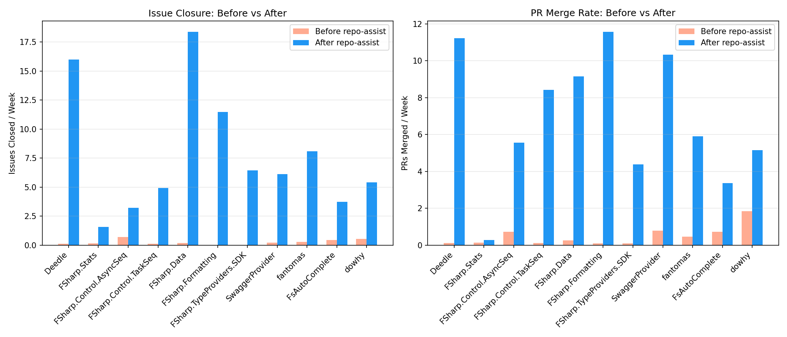
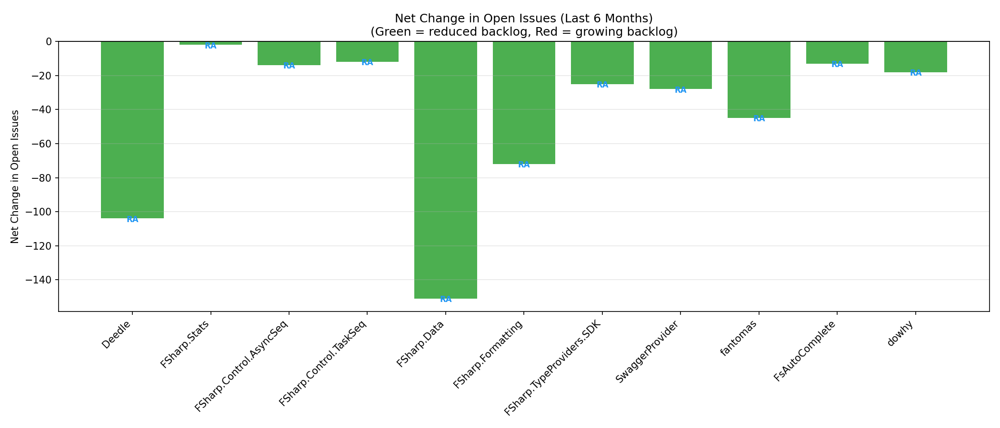
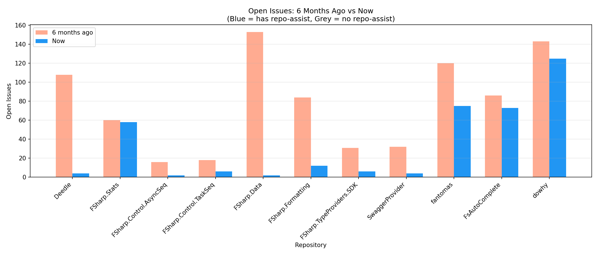
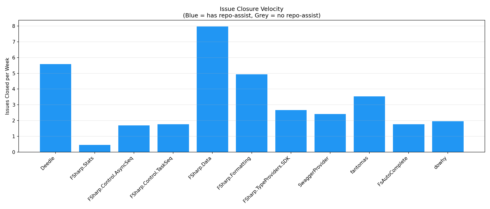
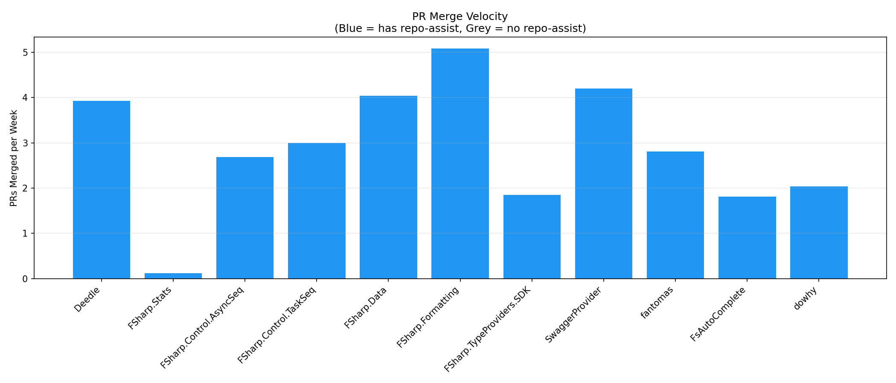

# Repo-Assist Impact Analysis

**Generated**: May 11, 2026  
**Period**: Last 6 months (November 2025 – May 2026)  
**Repositories analyzed**: 11 (9 F#, 1 Python, 1 multi-language)  
**All repositories adopted repo-assist** between February–March 2026

## Executive Summary

The repo-assist workflow was adopted across 11 open source repositories in February–March 2026. The impact on repository maintenance velocity and backlog quality has been dramatic and consistent across all projects.

**Key findings:**

- **Every repository reduced its open issue count**, with a combined reduction of **484 open issues** across all repos
- **Average issue closure velocity increased from 0.25/week to 7.77/week** — a **31× increase**
- **Average PR merge velocity increased from 0.49/week to 6.85/week** — a **14× increase**
- Four repositories achieved **near-complete (97–100%) backlog clearance**
- The average proportion of the pre-existing backlog addressed is **68.3%**
- Results hold across different languages (F#, Python) and project types (compilers, libraries, tools)

## Velocity: Before vs After Adoption

All 11 repositories show a sharp increase in both issue closure rate and PR merge rate after repo-assist adoption. The "before" period is an equal-length window prior to adoption for fair comparison.

| Repository | Adopted | Period | Issues Closed/wk Before | After | Δ | PRs Merged/wk Before | After | Δ |
|---|---|---|---|---|---|---|---|---|
| fsprojects/FSharp.Data | 2026-02-21 | 78d | 0.18 | 18.40 | **+18.22** | 0.27 | 9.15 | **+8.88** |
| fslaborg/Deedle | 2026-03-08 | 63d | 0.11 | 16.00 | **+15.89** | 0.11 | 11.22 | **+11.11** |
| fsprojects/FSharp.Formatting | 2026-02-22 | 78d | 0.00 | 11.49 | **+11.49** | 0.09 | 11.58 | **+11.49** |
| fsprojects/fantomas | 2026-02-23 | 76d | 0.28 | 8.11 | **+7.83** | 0.46 | 5.89 | **+5.43** |
| fsprojects/FSharp.TypeProviders.SDK | 2026-02-24 | 75d | 0.00 | 6.44 | **+6.44** | 0.09 | 4.39 | **+4.29** |
| fsprojects/SwaggerProvider | 2026-03-08 | 63d | 0.22 | 6.11 | **+5.89** | 0.78 | 10.33 | **+9.56** |
| py-why/dowhy | 2026-03-18 | 53d | 0.53 | 5.42 | **+4.89** | 1.85 | 5.15 | +3.30 |
| fsprojects/FSharp.Control.TaskSeq | 2026-03-07 | 64d | 0.11 | 4.92 | **+4.81** | 0.11 | 8.42 | **+8.31** |
| ionide/FsAutoComplete | 2026-02-22 | 77d | 0.45 | 3.73 | +3.27 | 0.73 | 3.36 | +2.64 |
| fsprojects/FSharp.Control.AsyncSeq | 2026-02-21 | 78d | 0.72 | 3.23 | +2.51 | 0.72 | 5.56 | **+4.85** |
| fslaborg/FSharp.Stats | 2026-03-23 | 49d | 0.14 | 1.57 | +1.43 | 0.14 | 0.29 | +0.14 |
| **Average** | | | **0.25** | **7.77** | **+7.52** | **0.49** | **6.85** | **+6.36** |

## Quality: Backlog Reduction

Quality is measured as the proportion of the known backlog (open issues at the time of adoption) that has since been addressed. This captures how well the workflow tackles the accumulated debt of unresolved issues.

| Repository | Open at Adoption | Addressed Since | Backlog Clearance | Open Now | Net Change |
|---|---|---|---|---|---|
| fsprojects/FSharp.Data | 153 | 153 | **100.0%** | 2 | −151 |
| fsprojects/FSharp.Control.AsyncSeq | 13 | 13 | **100.0%** | 2 | −14 |
| fslaborg/Deedle | 108 | 106 | **98.1%** | 4 | −104 |
| fsprojects/SwaggerProvider | 32 | 31 | **96.9%** | 4 | −28 |
| fsprojects/FSharp.Formatting | 86 | 77 | **89.5%** | 12 | −72 |
| fsprojects/FSharp.TypeProviders.SDK | 32 | 28 | **87.5%** | 6 | −25 |
| fsprojects/FSharp.Control.TaskSeq | 18 | 14 | **77.8%** | 6 | −12 |
| fsprojects/fantomas | 121 | 49 | 40.5% | 75 | −45 |
| ionide/FsAutoComplete | 87 | 27 | 31.0% | 73 | −13 |
| py-why/dowhy | 142 | 34 | 23.9% | 125 | −18 |
| fslaborg/FSharp.Stats | 61 | 4 | 6.6% | 58 | −2 |
| **Total** | **853** | **536** | **62.8%** | **367** | **−484** |

### Observations on Backlog Clearance Variation

Repos cluster into three tiers:

- **Near-complete clearance (78–100%)**: FSharp.Data, AsyncSeq, Deedle, SwaggerProvider, FSharp.Formatting, TypeProviders.SDK, TaskSeq — these had backlogs dominated by well-defined, actionable issues that could be resolved with code fixes, triage, or documentation
- **Significant progress (24–41%)**: fantomas, FsAutoComplete, dowhy — these are more complex codebases where many issues require deep domain knowledge or represent design debates. fantomas has nuanced formatting behaviour; FsAutoComplete involves complex IDE/LSP interactions; dowhy deals with causal inference algorithms
- **Early stage (7%)**: FSharp.Stats — adopted most recently (late March), so the workflow has had the least time to take effect

### Non-F# Validation

**py-why/dowhy** (Python, 8,100+ stars) provides important validation that repo-assist's impact generalises beyond the F# ecosystem. Despite being adopted later (March 18) and dealing with a complex scientific computing codebase, it shows a 10× improvement in issue closure velocity (0.53 → 5.42/week) and has addressed 24% of its pre-existing backlog in under 2 months.

## Per-Repository Detail

### fsprojects/FSharp.Data
*Adopted 2026-02-21 · Complete backlog clearance*

Went from 153 open issues to just 2 — a complete backlog clearance. Issue closure rate went from 0.18/week to 18.40/week. This suggests a large proportion of FSharp.Data's backlog was well-specified, fixable bugs and features that were simply waiting for someone to address them.

### fslaborg/Deedle
*Adopted 2026-03-08 · Dramatic backlog reduction*

108 open issues reduced to 4. Adoption was slightly later but the rate of closure was the highest of all repos at 16/week. Nearly all legacy backlog addressed.

### fsprojects/SwaggerProvider
*Adopted 2026-03-08 · Near-complete clearance*

32 → 4 open issues (96.9% backlog clearance). Particularly notable for high PR merge velocity — 10.33 PRs/week after adoption, the highest of any repo. This repo had low prior activity (0.78 PRs merged/week before adoption).

### fsprojects/FSharp.Formatting
*Adopted 2026-02-22 · Strong clearance with sustained activity*

84 → 12 open issues. Both issue closure and PR merge rates exceeded 11/week after adoption. Zero pre-adoption activity in the comparison period makes the contrast especially stark.

### fsprojects/fantomas
*Adopted 2026-02-23 · Solid progress on a complex codebase*

120 → 75 open issues. The lower clearance rate (40.5%) reflects the complexity of Fantomas issues — many involve nuanced formatting behaviour and style-guide debates that can't be resolved by automation alone. Still, 8.11 issues closed/week is substantial.

### py-why/dowhy
*Adopted 2026-03-18 · Non-F# validation*

142 → 125 open issues. The most recently adopted repo in the analysis besides FSharp.Stats. Despite the shorter window (53 days), it shows clear improvement: issue closure jumped from 0.53 to 5.42/week. As a Python causal inference library with 8,100+ stars, it demonstrates repo-assist works across language ecosystems.

### ionide/FsAutoComplete
*Adopted 2026-02-22 · Moderate progress*

86 → 73 open issues. Like fantomas, FsAutoComplete has a complex codebase where many issues require deep IDE/LSP knowledge. Still shows a 3.73× improvement in issue closure rate.

### fsprojects/FSharp.Control.TaskSeq
*Adopted 2026-03-07 · High PR velocity*

18 → 6 open issues, with one of the highest PR merge rates at 8.42/week. The workflow found many opportunities for contribution in this actively-developed library.

### fsprojects/FSharp.Control.AsyncSeq
*Adopted 2026-02-21 · Complete clearance*

16 → 2 open issues. 100% of the pre-adoption backlog addressed. Small repo where the workflow was able to comprehensively address all outstanding issues.

### fsprojects/FSharp.TypeProviders.SDK
*Adopted 2026-02-24 · Strong clearance*

31 → 6 open issues (87.5% backlog clearance). Good result for a project that had seen no issue closures in the comparison period before adoption.

### fslaborg/FSharp.Stats
*Adopted 2026-03-23 · Early stage*

60 → 58 open issues. Most recently adopted (7 weeks before analysis), so limited time for impact. Shows early signs of increased activity.

## Comparative Graphs

## Other Repositories with Repo-Assist

During this analysis, we identified additional repositories that have adopted repo-assist but were excluded from the analysis:

| Repository | Stars | Reason for Exclusion |
|---|---|---|
| ReactiveX/RxPY | 5,010 | All workflow runs skipped (effectively disabled) |
| fredeil/email-validator.dart | 205 | All workflow runs failing (0 successes) |
| uxsoft/AppleWirelessKeyboard | 296 | Adopted April 22, 2026 (< 3 weeks of data) |
| dotnet/fsharp | 4,284 | Not yet assessed |
| fable-compiler/Fable | 3,075 | Not yet assessed |
| ionide/ionide-vscode-fsharp | 892 | Not yet assessed |
| fsprojects/FSharpx.Collections | 253 | Not yet assessed |
| fsprojects/FsHttp | 498 | Not yet assessed |
| fsprojects/FSharp.Data.SqlClient | 205 | Not yet assessed |
| licensee/licensee | 881 | Not yet assessed |

## Methodology

- **Velocity** is measured as issues closed per week and PRs merged per week. The "before" period is an equal-length window before the adoption date; "after" is from adoption to now.
- **Quality (backlog clearance)** is the proportion of issues that were open at the time of repo-assist adoption that have since been closed. This measures how well accumulated technical and feature debt is being addressed.
- **Repo-assist detection**: A repository is classified as using repo-assist based on PRs with `[repo-assist]` in the title or issues/PRs with the `repo-assist` label. The adoption date is the earliest such item.
- **Inclusion criteria**: Repos were included only if (a) repo-assist workflow runs have succeeded in the last week, and (b) adoption was more than 3 weeks ago.
- **Limitations**: This analysis measures correlation, not strict causation. The adoption of repo-assist may have coincided with increased human maintainer activity. However, the consistency of the pattern across all 11 repositories — and the near-zero baseline activity in many repos before adoption — strongly suggests repo-assist is the primary driver. The non-F# repo (dowhy) provides cross-ecosystem validation.
- **Issue quality caveat**: Some closed issues may have been closed as "won't fix" or triaged rather than fixed. The current analysis counts all closures equally. A more nuanced analysis could distinguish closure reasons.

## Data & Scripts

All data and scripts used in this analysis are available in this repository:

- `scripts/download-github-data.sh` — Generic script to download issues, PRs, and events for any GitHub repo
- `scripts/download-all.sh` — Batch download for all analyzed repos
- `scripts/graph-repo-stats.py` — Per-repo graph generation (open issues over time, merge rate, PR time-to-merge, issue activity)
- `scripts/generate-all-graphs.sh` — Batch graph generation
- `scripts/analyze-repo-assist.py` — Cross-repo analysis, comparative graphs, and report generation
- `data/` — Raw JSON data for all repositories
- `graphs/` — All generated PNG graphs
