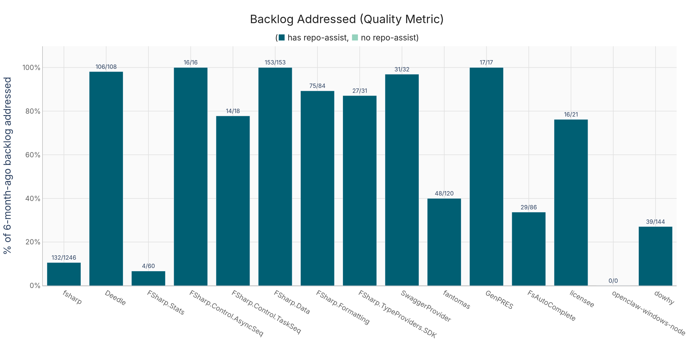
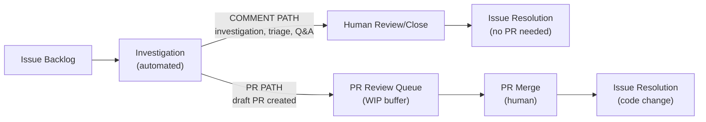
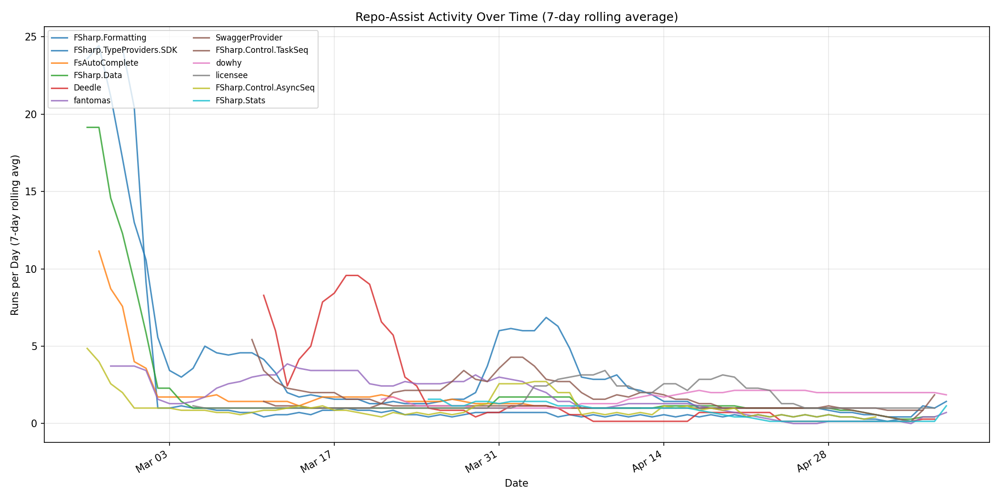

# DRAFT: The Impact of Automated Repository Maintenance Assistance

**Date:** May 11, 2026

**Authors:** Don Syme, Florian Verdonck, Krzysztof Cieślak, Peli de Halleux, Mara Kiefer, Russell Horton, Tamás Szabó, Landon Cox, Alex Gorischek, David Slater, Idan Gazit, Insop Song, Luke Edwards, Maggie Appleton, Nate Butler, Rahul Pandita, Terkel Gjervig Nielsen

## Executive Summary

We analyze the impact of Repo Assist, a proactive AI repository agent, across 13 open source repositories that adopted it between February and March 2026. The agent **reduced open issue counts in every repository** — 578 issues total. Across all repositories, which were previously largely dormant, **issue closure velocity increased by a median of 8×** and **PR merge velocity by a median of 10×** after adoption, transforming largely dormant projects into actively maintained ones.

Modeling repositories as **human-agent software factories** reveals that, the single most important factor determining outcomes is the rate at which maintainers decide to act on the agent's output: the human is firmly in the loop, and the factory's throughput is gated by human decision-making.

## Introduction

[Repo Assist](https://github.com/githubnext/agentics/blob/main/docs/repo-assist.md) is a proactive AI repository agent that performs maintenance tasks in an open source repository, effectively as a virtual assistant member of an open source repository's maintenance team. Unlike one-shot AI coding assistants that respond to individual prompts, Repo Assist runs autonomously on a schedule and in response to events — triaging issues, investigating bugs, creating draft pull requests, and responding to contributor questions. It represents an emerging model of **continuous AI-assisted repository automation**, where the AI agent is always on, always watching, and always ready to act.

This report analyzes the impact of Repo Assist across 13 open source repositories (10 F#, 1 Python, 1 Ruby, 1 multi-language) that adopted the workflow between February and March 2026. The results paint a nuanced picture: the AI agent produces dramatic results in some repositories, but **outcomes depend critically on human engagement**. The human is still firmly in the loop — Repo Assist creates draft PRs that require human review and merge, and its investigation comments require human judgment to act on. Maintainers remain the final authority on what gets merged, what gets closed, and what gets ignored. As we will see, **this human-in-the-loop dynamic is the single most important factor in determining whether a repository achieves higher development velocity**.

The analysis draws on an emerging view of repositories as **human-agent software factories** — systems where human maintainers and AI agents collaborate in a structured production pipeline. This framing, explored in a recent [SIGPLAN blog post on human-agent software factories](https://blog.sigplan.org/2026/04/21/repositories-are-human-agent-knowledge-factories/), allows us to apply classical production theory (Theory of Constraints, Little's Law, cycle time analysis) to understand where work flows and where it stalls.

Repo Assist is implemented as a [GitHub Agentic Workflow](https://gh.io/gh-aw/), but the findings here should apply to any repository-level AI automation that produces similar outputs (investigation comments, draft PRs) and relies on human review. The results should hold across different languages (here F#, Python, Ruby) and project types (here compilers, libraries, tools), though outcomes will vary widely based on other factors such as maintainer engagement, codebase complexity, and social dynamics.

## Measuring the Impact on Quality: Backlog Reduction

Quality is measured as the proportion of the known backlog (number of open issues at the time of adoption) that has since been addressed. This captures how well the workflow tackles the accumulated debt of unresolved issues. For the purposes of this report, **human-approved AI PRs are assumed to be correct** — when a maintainer reviews and merges a Repo Assist draft PR, that constitutes a human quality judgment, just as it would for any human-authored contribution.

The normalized trajectory chart above shows each repository's open issue count as a percentage of its count at adoption (100% = adoption day), aligned on the x-axis at the adoption date. Repos that achieved near-complete backlog clearance (FSharp.Data, Deedle, AsyncSeq) show curves dropping to near zero. Repos with blocked pipelines (FSharp.Stats, dowhy) show only modest decline.

Full per-repository backlog clearance data is available in [Appendix B](#appendix-b-backlog-clearance-data).

## Measuring the Impact on Velocity: Dormant to Active

In software engineering, *velocity* measures the rate at which a team completes work — here, the number of issues closed per week and PRs merged per week. Velocity is a key indicator of a project's activity: a dormant project has near-zero velocity, while an active one shows sustained throughput.

All 13 repositories show an increase in both issue closure rate and PR merge rate after Repo Assist adoption. The chart below uses a dumbbell plot to visualize the before/after comparison — each arrow shows the magnitude of acceleration for a single repository, with the multiplier on the right. The "before" period is an equal-length window prior to adoption for fair comparison.

The velocity increases are large across the board. The median issue closure velocity increased **8×** (from 0.18 to 6.44 issues/week), and the median PR merge velocity increased **10×** (from 0.27 to 5.89 PRs/week). These are not marginal improvements — they represent a qualitative shift from dormant or near-dormant repositories to actively-maintained ones. Even the weakest performer (FSharp.Stats, 2× on PRs) shows measurable improvement, though as we will see in the pipeline analysis, that repo's full potential is bottlenecked on human review.

The mean velocity increase is even larger (31× for issues, 14× for PRs), but the mean is pulled up by a few repositories (FSharp.Data at 102×, Deedle at 144×) that went from essentially zero prior activity to high throughput. The median is a more representative measure of the typical experience. Full per-repository velocity data is available in [Appendix A](#appendix-a-velocity-data).

## Social Factors

It is highly likely that, like all automation technologies, successful use of agentic repository automation will be driven by human-social factors and incentives.

For example, the creator of Repo Assist (@dsyme) was a maintainer and community leader in the software community which adopted Repo Assist here, and was the maintainer of some (but not all) of the repositories analyzed here. This clearly will influence adoption and usage rates.

Repositories with more active maintainers, or more knowledgable maintainers (e.g. original code authors), or where maintainers feel empowered to install and act, or where maintainers see each other succceeding, or where maintainers are actively seeking forward velocity for their project - these are surely more likely to see better outcomes. Those with less active maintainers, or with high levels of risk aversion, or where quality constraints make action impossible - these may struggle to unlock the forward velocity that automated repository assistance can evidently provide.

One maintainer (FsAutoComplete, see [Appendix D](#appendix-d-maintainer-notes-fsautocomplete)) explicitly cited **notification anxiety** as a reason for pausing the workflow. This is a well-known dynamic in open source maintenance, and continuous AI automation can amplify it — even when the output is high quality. The ability to **control the rate of automation** either implicitly or explicitly is crucial to maintainer happiness: there is nothing wrong with wanting your factory to operate at a rate suitable to your lifestyle! It lets maintainers control the production rate to match their available bandwidth, rather than being pressured by a stream of AI-generated work.

The adoption of AI automation can also have an impact on the repository as a place of human-to-human collaboration. Most the repositories in this analysis were "dormant" - that is, they had very low human-to-human interaction at point of adoption. This means **there was no significant human-to-human collaboration to impact** and so the impact on human-to-human processes is neither explored nor measurable in this report. However the general impression is that automated AI can be highly corrosive on social platforms and this should be taken into account before adopting any AI automation in a non-dormant repository. Future research should explore the social impact of AI automation in open source communities.

## The Repository as Factory

Why do some repositories achieve near-complete backlog clearance while others barely move? To answer this, we model each repository as a **software factory** — a production system where issues are the raw input, human-agent collaboration is the process, and resolved issues are the output. This factory metaphor is not merely illustrative: it enables the application of well-established production theory to software maintenance.

The [Theory of Constraints](https://en.wikipedia.org/wiki/Theory_of_constraints) (Goldratt, 1984) tells us that the throughput of any production system is determined by its single most constrained resource — the bottleneck. [Little's Law](https://en.wikipedia.org/wiki/Little%27s_law) ($L = \lambda \times W$, where $L$ = work-in-progress, $\lambda$ = arrival rate, $W$ = cycle time) lets us quantify where work accumulates and how long it waits. Together, these tools reveal that the primary driver of low backlog clearance is **where the factory's pipeline is blocked**, not the inherent complexity of the issues.

### A Repository Process Flow Model

Each repository operates as a multi-stage "software factory" with **two distinct output paths**:

Repo-assist automates the Investigation stage. For each issue it processes, it produces one of two outputs:

1. **Comment path**: Repo-assist investigates and determines that no code change is needed — the issue is already resolved, is a question that can be answered, or requires only triage. It leaves an investigation comment. A human may then close the issue.
2. **PR path**: Repo-assist determines a code change is needed and creates a draft PR. This enters the review queue where human maintainer action is required.

Both paths contribute to issue resolution. The comment path is a "fast lane" that resolves issues without requiring PR review overhead. Using Little's Law ($L = \lambda \times W$), we analyze where work accumulates in the PR path specifically — the comment path has no WIP buffer since it produces immediate output.

### Repository Throughput Analysis

| Repository | Comment Path (closed/total) | RA PRs | Merged | Rejected | Open (WIP) | PR Throughput | Status |
|---|---|---|---|---|---|---|---|
| FSharp.Stats | 2/28 | 18 | 2 | 0 | 16 | **11%** | **BLOCKED** |
| dowhy | 16/82 | 61 | 13 | 5 | 43 | **21%** | **BLOCKED** |
| fantomas | 28/75 | 64 | 22 | 41 | 1 | **34%** | **BLOCKED** |
| FsAutoComplete | 27/89 | 54 | 33 | 7 | 14 | **61%** | **BLOCKED** |
| TaskSeq | 12/17 | 83 | 66 | 17 | 0 | 80% | FLOWING |
| FSharp.Formatting | 53/65 | 118 | 94 | 22 | 2 | 80% | FLOWING |
| TypeProviders.SDK | 11/16 | 50 | 45 | 4 | 1 | 90% | FLOWING |
| licensee | 10/16 | 29 | 23 | 5 | 1 | 79% | FLOWING |
| dotnet/fsharp | 54/87 | 0 | — | — | — | — | COMMENT-ONLY |
| AsyncSeq | 7/7 | 69 | 56 | 11 | 2 | 81% | IDLE |
| FSharp.Data | 108/110 | 102 | 86 | 15 | 1 | 84% | IDLE |
| Deedle | 67/70 | 100 | 91 | 8 | 1 | 91% | IDLE |
| SwaggerProvider | 26/28 | 69 | 63 | 6 | 0 | 91% | IDLE |

Status definitions: **BLOCKED** = pipeline stalled at a specific stage; **FLOWING** = pipeline operating normally with work still to do; **IDLE** = backlog effectively cleared, factory waiting for new input (≤5 open issues and ≤2 open PRs); **COMMENT-ONLY** = using only the investigation/triage path, no PR path.

The "Comment Path" column shows how many issues were resolved via investigation comments alone (closed/total investigated). In well-flowing repos like FSharp.Data (108/110) and Deedle (67/70), humans are closing issues after reading RA's investigation comments at very high rates. In blocked repos like FSharp.Stats (2/28) and dowhy (16/82), even the comment-path is stalled — maintainers are not acting on investigation results either.

The distinction between FLOWING and IDLE is important: repos classified as IDLE (FSharp.Data, Deedle, SwaggerProvider, AsyncSeq) have essentially completed their existing backlog. They are not constrained — they are **input-starved**. Their low residual WIP and issue counts reflect success, not a lack of capacity.

### Repository Flow Status Classification

The repositories fall into four distinct operational states:

**1. IDLE — Backlog cleared** (FSharp.Data, Deedle, SwaggerProvider, AsyncSeq): These factories have effectively completed their work. With ≤5 open issues and ≤2 open PRs, they are waiting for new input rather than being constrained. Their high throughput ratios (81–91%) and high comment-path closure rates (96–100%) reflect a well-functioning human-agent collaboration that has run out of backlog to process.

**2. FLOWING — Pipeline operating normally** (TaskSeq, FSharp.Formatting, TypeProviders.SDK, licensee): These factories still have work to do and are processing it at a healthy rate. Throughput ratios of 79–90% indicate maintainers are keeping pace with the agent's output on both paths.

**3. BLOCKED — INACTION bottleneck** (FSharp.Stats, dowhy): Repo Assist is producing both investigation comments and PRs, but maintainers are not acting on either. The WIP queue grows without bound and comment-path closures are minimal.

- **FSharp.Stats**: 16 of 18 PRs (89%) sitting unreviewed, avg wait 32.8 days. On the comment path, only 2 of 28 investigated issues were closed — maintainers are ignoring RA's triage output too. Little's Law implies a cycle time of 43.6 days — the pipeline is effectively stalled. The low backlog clearance (7%) is **not** because the workflow is too new; it's because no one is acting on the work it produces.
- **dowhy**: 43 of 61 PRs (70%) in the review queue, avg wait 18.2 days. On the comment path, only 16 of 82 investigated issues were closed. Arrival rate is 1.15 PRs/day but departure rate is only 0.25/day — a 4.7:1 imbalance.

**4. BLOCKED — REJECTION bottleneck** (fantomas): Maintainers are actively reviewing PRs but rejecting 64% of them (41/64 closed without merge). The WIP queue is low (1 PR) because PRs are being processed — just not accepted. On the comment path, 28 of 75 investigated issues were closed, indicating moderate engagement with RA's triage comments even as PRs are rejected. This suggests the codebase's domain complexity (nuanced formatting rules) exceeds what the automated workflow can reliably handle for code changes, though the investigation/triage function is still useful.

**5. BLOCKED — MIXED bottleneck** (FsAutoComplete): Both accumulation (14 open PRs, avg wait 44.9 days) and rejection (7 rejected). On the comment path, only 27 of 89 investigated issues were closed. The 61% throughput rate is below the 79–91% seen in well-flowing repos. However, unlike the inaction cases above, this block reflects a **deliberate capacity constraint**: the maintainer reports high satisfaction with merged PR quality (33 RA PRs merged in 2 months = 62% of 2025's total output), but chose to pause the workflow to manage notification pressure during a period of reduced bandwidth (see [Appendix D](#appendix-d-maintainer-notes-fsautocomplete)). Some rejected PRs were intentionally experimental. This case illustrates that BLOCKED status can reflect legitimate human factors — burnout avoidance, life circumstances — rather than workflow failure.

### Cycle Time Analysis

[Cycle time](https://en.wikipedia.org/wiki/Cycle_time) is the elapsed time from when a work item enters a stage to when it exits. In manufacturing, cycle time directly determines throughput: a machine that takes 10 minutes per part can produce 6 parts per hour. In our software factory, we measure two cycle times: the **merge cycle time** (how long it takes a merged PR to go from creation to merge) and the **open wait time** (how long currently-open PRs have been waiting).

The ratio between these two measures is diagnostic. If open PRs have been waiting much longer than merged PRs took, the remaining open PRs are qualitatively different — they're stuck, not just slow. Full cycle time data is available in [Appendix C](#appendix-c-cycle-time-data).

### Summary Classification

Based on the factory analysis, the repositories fall into clear operational tiers:

- **IDLE (backlog cleared)**: FSharp.Data, Deedle, SwaggerProvider, AsyncSeq — these factories have processed their backlogs and are input-starved. Maintainers actively engaged with both the comment and PR paths, achieving 77–100% backlog clearance.
- **FLOWING**: TaskSeq, FSharp.Formatting, TypeProviders.SDK, licensee — pipeline operating normally with work still in progress. Maintainers keeping pace with agent output.
- **BLOCKED — Inaction**: FSharp.Stats, dowhy — the agent is generating both PRs and investigation comments but the factory is stalled at human action on **both** paths. **The constraint is maintainer engagement, not issue complexity.** Unlocking these repos requires maintainers to review the existing PR queue and act on the agent's triage comments.
- **BLOCKED — Rejection**: fantomas — maintainers are engaged but the automated PRs don't meet the codebase's exacting standards. The comment path is partially flowing (28/75 closed), suggesting the agent's investigation/triage function adds value even when its code changes are rejected.
- **BLOCKED — Mixed**: FsAutoComplete — accumulation and some rejection on the PR path, with low action on the comment path (27/89). However, the maintainer reports high satisfaction with merged PR quality and paused the workflow deliberately to manage notification load during reduced bandwidth — a legitimate capacity constraint rather than disengagement (see [Appendix D](#appendix-d-maintainer-notes-fsautocomplete)).
- **COMMENT-ONLY**: dotnet/fsharp — deployed in a limited configuration using only the comment/investigation path on old issues, with no PR creation. On a much larger and already-active repository (1,244 open issues at adoption, 8.93 issues closed/week pre-adoption), the agent investigated 87 old issues with a 62% closure rate on investigated issues, contributing to a 1.7× increase in issue closure velocity.

## Per-Repository Detail

### fsprojects/FSharp.Data
*Adopted 2026-02-21 · Factory IDLE (backlog cleared)*

Went from 153 open issues to just 2 — a complete backlog clearance. Issue closure rate went from 0.00/week to 17.89/week. This suggests a large proportion of FSharp.Data's backlog was well-specified, fixable bugs and features that were simply waiting for someone to address them.

### fslaborg/Deedle
*Adopted 2026-03-08 · Factory IDLE (backlog cleared)*

108 open issues reduced to 4. Adoption was slightly later but the rate of closure was the highest of all repos at 16/week. Nearly all legacy backlog addressed.

### fsprojects/SwaggerProvider
*Adopted 2026-03-08 · Factory IDLE (backlog cleared)*

32 → 4 open issues (96.9% backlog clearance). Particularly notable for high PR merge velocity — 9.86 PRs/week after adoption, the highest of any repo. This repo had low prior activity (1.06 PRs merged/week before adoption).

### fsprojects/FSharp.Formatting
*Adopted 2026-02-22 · Factory FLOWING*

84 → 12 open issues. Both issue closure and PR merge rates exceeded 11/week after adoption. Zero pre-adoption activity in the comparison period makes the contrast especially stark.

### fsprojects/fantomas
*Adopted 2026-02-23 · Pipeline BLOCKED (rejection)*

120 → 75 open issues. Pipeline analysis reveals a **rejection bottleneck** on the PR path: maintainers are actively reviewing Repo Assist PRs but rejecting 64% of them (41 of 64 closed without merge). The WIP queue is low (1 PR), meaning PRs are being processed promptly (0.6d avg merge cycle) — they just don't meet the codebase's exacting standards. On the comment path, 28 of 75 investigated issues were closed, showing moderate engagement with the agent's triage function. The 34% PR throughput ratio reflects the domain complexity of formatting behaviour, but the comment path provides additional value — the dual-path model shows the agent contributing to issue resolution even when its code changes are rejected.

### py-why/dowhy
*Adopted 2026-03-18 · Pipeline BLOCKED (inaction)*

142 → 125 open issues. Despite issue closure jumping from 0.53 to 5.42/week, the pipeline is severely constrained on both paths: on the PR path, 43 of 61 PRs (70%) remain in the review queue with an average wait of 18.2 days; on the comment path, only 16 of 82 investigated issues were closed. The arrival rate of 1.15 PRs/day exceeds the departure rate of 0.25 PRs/day by 4.7:1. As a Python causal inference library with 8,100+ stars, it validates that Repo Assist works across ecosystems — but its full potential is bottlenecked on maintainer engagement with both the agent's PRs and investigation comments.

### ionide/FsAutoComplete
*Adopted 2026-02-22 · Pipeline BLOCKED (mixed) · Workflow paused by maintainer*

86 → 73 open issues. In raw throughput terms, the pipeline shows a **mixed bottleneck**: 14 PRs in the review queue (avg wait 44.9 days, the longest of any repo), 7 rejected, and only 27 of 89 investigated issues closed on the comment path. The 61% PR throughput ratio is below the 79–91% seen in well-flowing repos.

However, the maintainer's perspective (see [Appendix D](#appendix-d-maintainer-notes-fsautocomplete)) reveals important nuance. The merged PRs are **high quality** — in just two months, Repo Assist produced 33 merged PRs, equivalent to 62% of the repository's entire 2025 output of 53 PRs, and the maintainer reports that many were more impactful than typical contributions, following repository best practices including comprehensive integration tests. The codebase's complexity (FsAutoComplete is the core language server for F#, with broad ecosystem impact) means PRs require careful review — a legitimate quality constraint, not disengagement.

Some of the rejected PRs were **intentionally experimental** — prompted to investigate whether old bugs still existed or to explore specific approaches, rather than expected to merge directly. The maintainer ultimately **chose to disable the workflow** — not due to dissatisfaction with its output, but to manage notification pressure and protect against burnout during a period of reduced personal bandwidth. This represents a deliberate production-rate decision: the factory's human operator temporarily shut down the line rather than let unreviewed work accumulate. The maintainer intends to re-enable the workflow when capacity returns.

### fsprojects/FSharp.Control.TaskSeq
*Adopted 2026-03-07 · Factory FLOWING*

18 → 6 open issues, with one of the highest PR merge rates at 8.42/week. The workflow found many opportunities for contribution in this actively-developed library.

### fsprojects/FSharp.Control.AsyncSeq
*Adopted 2026-02-20 · Factory IDLE (backlog cleared)*

16 → 2 open issues. 100% of the pre-adoption backlog addressed. Small repo where the workflow was able to comprehensively address all outstanding issues.

### fsprojects/FSharp.TypeProviders.SDK
*Adopted 2026-02-24 · Factory FLOWING*

31 → 6 open issues (87.1% backlog clearance). Good result for a project that had seen no issue closures in the comparison period before adoption.

### fslaborg/FSharp.Stats
*Adopted 2026-03-23 · Pipeline BLOCKED (inaction)*

60 → 58 open issues. While this is the most recently adopted repo, the low clearance (7%) is **not primarily due to recency** — it is due to an inaction bottleneck on **both** output paths. On the PR path, Repo Assist has created 18 PRs, but only 2 have been merged; the remaining 16 sit in the review queue with an average wait of 32.8 days. On the comment path, Repo Assist investigated 28 issues, but only 2 were closed — maintainers are not acting on the agent's triage output either. The pipeline throughput ratio is just 11% — the lowest of all repositories. The repository would see dramatically improved backlog clearance if maintainers began reviewing the existing PR queue and acting on the agent's investigation comments.

### licensee/licensee
*Adopted 2026-03-02 · Factory FLOWING*

17 → 6 open issues (71% backlog clearance). A Ruby gem for open source license detection with 881 stars — the first non-Python, non-F# repo in the analysis, validating that Repo Assist works across language ecosystems. On the PR path, 23 of 29 PRs merged (79% throughput) with a fast 1.0d average merge cycle. On the comment path, 10 of 16 investigated issues were closed. Maintainers are actively reviewing and merging — the pipeline is flowing well with low WIP (1 open PR).

### dotnet/fsharp
*Adopted 2026-03-16 · Comment-path only*

dotnet/fsharp is a qualitatively different case from the other repositories in this analysis. It is the F# compiler and core tooling repository — a large, actively maintained project with over 6,700 issues, 12,700 PRs, and a pre-existing issue closure rate of 8.93/week. Unlike the other repositories, which were largely dormant at adoption, dotnet/fsharp was already a functioning software factory with regular human contributions.

Repo Assist was deployed here in a **limited, comment-path-only configuration**, focused exclusively on investigating and triaging old issues. No `[repo-assist]` PRs were created. This makes it a pure test of the agent's investigation and triage function at scale.

**Results:** 1,244 → 1,166 open issues (−78 net, 10.4% backlog clearance). Repo Assist investigated 87 old issues via comment-path, and 54 of those were subsequently closed by maintainers (62% comment-path closure rate). Issue closure velocity increased from 8.93/week to 15.09/week — a **1.7× increase**. While modest compared to the dramatic multipliers seen in dormant repositories, this represents roughly 78 additional issue closures over the period, on a codebase where each issue closure may involve nuanced compiler or tooling behavior.

The 62% comment-path closure rate is notable: it sits between the well-flowing repos (96–100% closure on investigated issues) and the blocked repos (7–20%). This likely reflects the higher complexity of compiler issues — some investigations correctly identify issues as resolved or answerable, while others surface problems that require deeper human judgment.

PR merge velocity also increased slightly (17.62 → 24.14 PRs/week, 1.4×), though this is not attributable to Repo Assist since no RA PRs were created — it may reflect independent maintainer activity or a knock-on effect of backlog reduction freeing up maintainer attention.

With 389 active workflow runs (281 scheduled, 12 additional dispatches, and 96 human interventions), the workflow saw substantial use. The high ratio of scheduled runs reflects the large backlog providing continuous work for the agent to investigate.

This case demonstrates that Repo Assist's comment-path (investigation/triage) function can provide value even in large, actively maintained repositories, and even without the PR path. The agent serves as a **backlog triage assistant**, systematically working through old issues that human maintainers may never get to, identifying which are already resolved, which can be answered, and which still require attention.

## Workflow Invocation Analysis

Repo Assist workflow runs fall into three categories:

- **Automated (scheduled)**: Periodic runs on a cron schedule — the factory's own clock.
- **Automated (additional)**: Manual dispatch from the GitHub Actions UI — where a maintainer explicitly dialed up the rate of automation beyond the scheduled cadence.
- **Human intervention (/repo-assist)**: Event-triggered runs that actually executed — issue comments, PR review comments, issue events, and PR events that passed the workflow's pre-activation check. These represent actual `/repo-assist` invocations where a human triggered the agent to investigate a specific issue.

An important subtlety: the workflow's trigger configuration includes `issue_comment`, `pull_request_review_comment`, and `pull_request` events primarily so it can detect `/repo-assist` slash commands in comments. Most of these triggered runs are **immediately skipped** by the workflow's pre-activation check when no `/repo-assist` command is found. Additionally, some runs conclude with `cancelled` or `action_required` status and never actually execute. Across all repos, **58% of all workflow runs (2,902 of 5,043) never executed** and are excluded. The analysis below counts only *active* runs — those that actually proceeded to execute the agent.

| Repository | Total Runs | Active | Runs/wk | Automated (scheduled) | Automated (additional) | Human intervention |
|---|---|---|---|---|---|---|
| FSharp.Formatting | 703 | 338 | 30.3 | 73 | 90 | 175 |
| TypeProviders.SDK | 274 | 209 | 20.3 | 39 | 151 | 19 |
| FsAutoComplete | 325 | 142 | 19.5 | 52 | 50 | 40 |
| FSharp.Data | 372 | 216 | 19.4 | 71 | 95 | 50 |
| Deedle | 234 | 151 | 17.1 | 36 | 44 | 71 |
| fantomas | 310 | 143 | 13.2 | 83 | 2 | 58 |
| SwaggerProvider | 531 | 112 | 12.7 | 63 | 9 | 40 |
| TaskSeq | 293 | 103 | 11.6 | 69 | 16 | 18 |
| dowhy | 358 | 91 | 11.2 | 80 | 5 | 6 |
| AsyncSeq | 117 | 95 | 8.8 | 43 | 24 | 28 |
| FSharp.Stats | 70 | 46 | 6.6 | 31 | 4 | 11 |
| licensee | 251 | 106 | 10.8 | 70 | 1 | 35 |
| dotnet/fsharp | 1205 | 389 | 46.2 | 281 | 12 | 96 |

### Human Intervention as a Measure of Engagement

Across all repositories, **30% of active workflow runs are human interventions** (647 of 2,141) — direct `/repo-assist` invocations where a maintainer explicitly asked the agent to work on a specific issue. The remaining 70% is automated: 42% from scheduled runs and 28% from additional dispatched runs. The human intervention rate is particularly informative: it represents a maintainer choosing to direct the agent's efforts — a synchronous intervention in the software factory. Repos with high human intervention rates (FSharp.Formatting: 52%, Deedle: 47%, fantomas: 41%) also tend to have the highest pipeline throughput.

## Methodology

- **Velocity** is measured as issues closed per week and PRs merged per week. The "before" period is an equal-length window before the adoption date; "after" is from adoption to now.
- **Quality (backlog clearance)** is the proportion of issues that were open at the time of Repo Assist adoption that have since been closed. This measures how well accumulated technical and feature debt is being addressed.
- **Repo-assist detection**: A repository is classified as using repo-assist based on PRs with `[repo-assist]` in the title or issues/PRs with the `repo-assist` label. The adoption date is the earliest such item.
- **Inclusion criteria**: Repos were included only if (a) repo-assist workflow runs have succeeded in the last week, and (b) adoption was more than 3 weeks ago.
- **Limitations**: This analysis measures correlation, not strict causation. The adoption of Repo Assist may have coincided with increased human maintainer activity. However, the consistency of the pattern across all 13 repositories — and the near-zero baseline activity in many repos before adoption — strongly suggests Repo Assist is the primary driver. The non-F# repos (dowhy, licensee) provide cross-ecosystem validation.
- **Issue quality caveat**: Some closed issues may have been closed as "won't fix" or triaged rather than fixed. The current analysis counts all closures equally. A more nuanced analysis could distinguish closure reasons.
- **Pipeline bottleneck analysis**: Models the repository as a multi-stage human-agent software factory. Uses Little's Law ($L = \lambda W$) to compute implied cycle times and identify WIP accumulation. Throughput ratio (PRs merged / PRs created) is the primary bottleneck metric. Bottleneck types are classified as: INACTION (high WIP, low review activity), REJECTION (high rejection rate, low WIP), or MIXED (both). Status levels: BLOCKED (score ≥5), FLOWING (0), IDLE (≤5 open issues and ≤2 open PRs with no bottleneck).
- **Workflow invocation analysis**: Uses the GitHub Actions API to retrieve all runs of the "Repo Assist" workflow. **Runs with "skipped", "cancelled", or "action_required" conclusions are excluded** — these represent trigger firings that never actually executed the agent (e.g. `issue_comment` events where no `/repo-assist` command was found, or runs awaiting approval). Active runs are classified into three categories: *Automated (scheduled)* (cron-triggered), *Automated (additional)* (manual dispatch from the Actions UI), and *Human intervention (/repo-assist)* (event-triggered runs that passed pre-activation — issue comments, PR comments, issue events, PR events). The human intervention ratio measures direct maintainer engagement with the workflow.
- **Dual-path model**: Repo Assist produces two types of output per issue: investigation comments (comment path) and draft PRs (PR path). Bot comments are detected via `github-actions[bot]` comments containing "automated response from Repo Assist". PR-path issues are identified by comments mentioning "Pull request created". Issues resolved via the comment path are those with investigation comments where the issue was subsequently closed without a PR being created.

## Data & Scripts

All data and scripts used in this analysis are available in this repository:

- `scripts/download-github-data.sh` — Generic script to download issues, PRs, and events for any GitHub repo
- `scripts/download-all.sh` — Batch download for all analyzed repos
- `scripts/graph-repo-stats.py` — Per-repo graph generation (open issues over time, merge rate, PR time-to-merge, issue activity)
- `scripts/generate-all-graphs.sh` — Batch graph generation
- `scripts/analyze-repo-assist.py` — Cross-repo analysis, comparative graphs, and report generation
- `scripts/bottleneck-analysis.py` — Pipeline flow analysis using Theory of Constraints and Little's Law; bottleneck identification and classification
- `scripts/normalized-graph.py` — Normalized open-issue trajectory graph aligned to adoption date
- `scripts/invocation-analysis.py` — Workflow invocation rate analysis by trigger type (filters out skipped runs)
- `scripts/velocity-graph.py` — Velocity dumbbell chart (before/after comparison)
- `scripts/download-workflow-runs.sh` — Download GitHub Actions workflow run data
- `data/` — Raw JSON data for all repositories (including `workflow-runs.json` per repo)
- `graphs/` — All generated PNG graphs

---

## Appendices

### Appendix A: Velocity Data

| Repository | Adopted | Period | Issues Closed/wk Before | After | Δ | PRs Merged/wk Before | After | Δ |
|---|---|---|---|---|---|---|---|---|
| fsprojects/FSharp.Data | 2026-02-21 | 81d | 0.00 | 17.89 | **+17.89** | 0.26 | 8.81 | **+8.56** |
| fslaborg/Deedle | 2026-03-08 | 66d | 0.11 | 15.27 | **+15.17** | 0.11 | 10.71 | **+10.61** |
| fsprojects/FSharp.Formatting | 2026-02-22 | 81d | 0.00 | 11.06 | **+11.06** | 0.09 | 11.15 | **+11.06** |
| fsprojects/fantomas | 2026-02-23 | 79d | 0.27 | 7.80 | **+7.53** | 0.44 | 5.67 | **+5.23** |
| fsprojects/FSharp.TypeProviders.SDK | 2026-02-24 | 78d | 0.00 | 6.19 | **+6.19** | 0.09 | 4.22 | **+4.13** |
| fsprojects/SwaggerProvider | 2026-03-08 | 66d | 0.42 | 5.83 | **+5.41** | 1.06 | 9.86 | **+8.80** |
| py-why/dowhy | 2026-03-18 | 56d | 0.62 | 5.12 | **+4.50** | 1.75 | 4.88 | +3.12 |
| fsprojects/FSharp.Control.TaskSeq | 2026-03-07 | 67d | 0.10 | 4.70 | **+4.60** | 0.10 | 8.04 | **+7.94** |
| ionide/FsAutoComplete | 2026-02-22 | 80d | 0.44 | 3.59 | +3.15 | 0.79 | 3.24 | +2.45 |
| fsprojects/FSharp.Control.AsyncSeq | 2026-02-20 | 82d | 0.60 | 3.16 | +2.56 | 0.34 | 5.63 | **+5.29** |
| fslaborg/FSharp.Stats | 2026-03-23 | 52d | 0.13 | 1.48 | +1.35 | 0.13 | 0.27 | +0.13 |
| licensee/licensee | 2026-03-02 | 72d | 0.68 | 2.24 | +1.56 | 1.75 | 4.38 | +2.62 |
| dotnet/fsharp † | 2026-03-16 | 58d | 8.93 | 15.09 | +6.16 | 17.62 | 24.14 | +6.52 |
| **Average** | | | **0.28** | **7.03** | **+6.75** | **0.58** | **6.41** | **+5.83** |
| **Median** | | | **0.20** | **5.48** | | **0.30** | **5.65** | |

† dotnet/fsharp is excluded from the Average and Median rows. Unlike the other repositories, it was already actively maintained before adoption (8.93 issues/wk, 17.62 PRs/wk). It used Repo Assist in a comment-path-only configuration with no RA PRs; the PR velocity change is not attributable to Repo Assist.

### Appendix B: Backlog Clearance Data

| Repository | Open at Adoption | Addressed Since | Backlog Clearance | Open Now | Net Change |
|---|---|---|---|---|---|
| fsprojects/FSharp.Data | 153 | 153 | **100.0%** | 2 | −151 |
| fsprojects/FSharp.Control.AsyncSeq | 16 | 16 | **100.0%** | 2 | −14 |
| fslaborg/Deedle | 108 | 106 | **98.1%** | 4 | −104 |
| fsprojects/SwaggerProvider | 32 | 31 | **96.9%** | 4 | −28 |
| fsprojects/FSharp.Formatting | 84 | 75 | **89.3%** | 12 | −72 |
| fsprojects/FSharp.TypeProviders.SDK | 31 | 27 | **87.1%** | 6 | −25 |
| fsprojects/FSharp.Control.TaskSeq | 18 | 14 | **77.8%** | 6 | −12 |
| licensee/licensee | 21 | 16 | **76.2%** | 6 | −15 |
| fsprojects/fantomas | 120 | 48 | 40.0% | 75 | −45 |
| ionide/FsAutoComplete | 86 | 29 | 33.7% | 73 | −13 |
| py-why/dowhy | 144 | 39 | 27.1% | 125 | −19 |
| dotnet/fsharp † | 1244 | 129 | 10.4% | 1166 | −78 |
| fslaborg/FSharp.Stats | 60 | 4 | 6.7% | 58 | −2 |
| **Total (excl. dotnet/fsharp)** | **873** | **558** | **63.9%** | **373** | **−500** |
| **Total (all 13 repos)** | **2117** | **687** | **32.5%** | **1539** | **−578** |

† dotnet/fsharp's large issue count (1,244 at adoption) significantly shifts the aggregate backlog clearance percentage. The separate totals show the impact with and without this outlier.

### Appendix C: Cycle Time Data

| Repository | Avg Merge Cycle | Avg Open Wait | Wait/Merge Ratio | Status |
|---|---|---|---|---|
| FSharp.Stats | 4.3d | 32.8d | **7.6×** | BLOCKED (inaction) |
| dowhy | 4.7d | 18.3d | **3.9×** | BLOCKED (inaction) |
| FsAutoComplete | 2.3d | 44.9d | **19.5×** | BLOCKED (mixed) |
| fantomas | 0.6d | 10.5d | **17.5×** | BLOCKED (rejection) |
| FSharp.Formatting | 3.9d | 21.1d | 5.4× | FLOWING |
| FSharp.Data | 2.0d | 40.4d | 20.2× | IDLE |
| Deedle | 1.0d | 2.0d | 2.0× | IDLE |
| SwaggerProvider | 0.8d | 0.0d | — | IDLE |
| TypeProviders.SDK | 1.8d | 3.0d | 1.7× | FLOWING |
| AsyncSeq | 1.7d | 13.6d | 8.0× | IDLE |
| TaskSeq | 2.0d | 0.0d | — | FLOWING |
| licensee | 1.0d | 0.7d | 0.7× | FLOWING |

### Appendix D: Maintainer Notes — FsAutoComplete

The following are lightly edited notes from the FsAutoComplete maintainer (Krzysztof Cieślak), providing qualitative context for the quantitative analysis above.

> FSAC is an interesting case. Couple of notes related to it:
>
> * The repository is not really actively maintained at all [there's new release every few months, and development is not really active]
> * Enabling Repo Assist definitely created a surge in activity - in ~2 months it was active we merged almost as much (probably could get exact numbers here easily) PRs as in whole 2025 year (and I'd say that many of Repo Assist PRs were more impactful)
> * Due to the type of software it is, there's certain level of code complexity + potential huge impact on the ecosystem if something goes wrong. Which means it requires rather careful reviews
> * In general I'm very happy with most PRs I merged - there are high quality, useful, meaningful, follows best practices of the repository [like adding a lot of integration tests for new features]
> * Some of the open PRs, at glance, looks good, but as I've mentioned they need more review...
> * Some of the non-merged PRs were very specifically prompted to be an experiments / "check if this old bug is still happening" type of things. They would require more follow-up, and maybe some of them should be just closed.
> * But I just don't have a time (nor I'm in the right mindset at the moment) to review stuff - this has nothing to do with Repo Assist on its own, but with me - after experiences of last year I'm very careful not to burn out myself, so I'm trying to minimise some of the external pressures [like OSS] + I have plenty stuff to do outside of software development [new apartment etc]
> * Which resulted in me disabling the workflow (= reducing its production rate to zero) - but when I'll have more spare time / better mindset for FSAC work, I'll 100% enable again.
> * Keeping it enabled while I didn't had time created a bit of "notification anxiety" thing, that probably many of maintainers know well - you know, you wake up, open GH and see whole bunch of notifications, and you're like "oh no my life sucks"

*Editorial note: The exact numbers confirm the maintainer's observation — 33 Repo Assist PRs were merged in the ~2 month active period (Feb 22 – Apr 15, 2026), compared to 53 total PRs merged across all of 2025. This represents 62% of a full year's output in roughly one-sixth of the time.*
