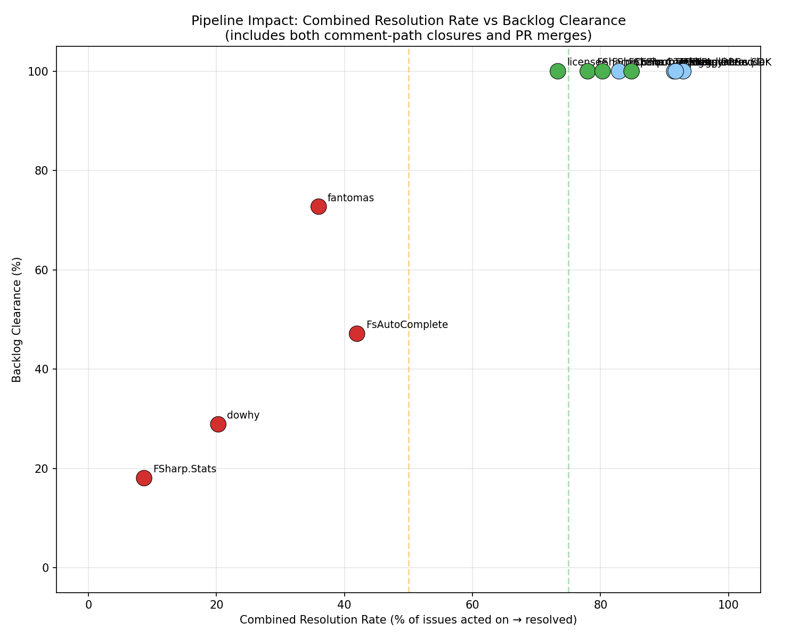
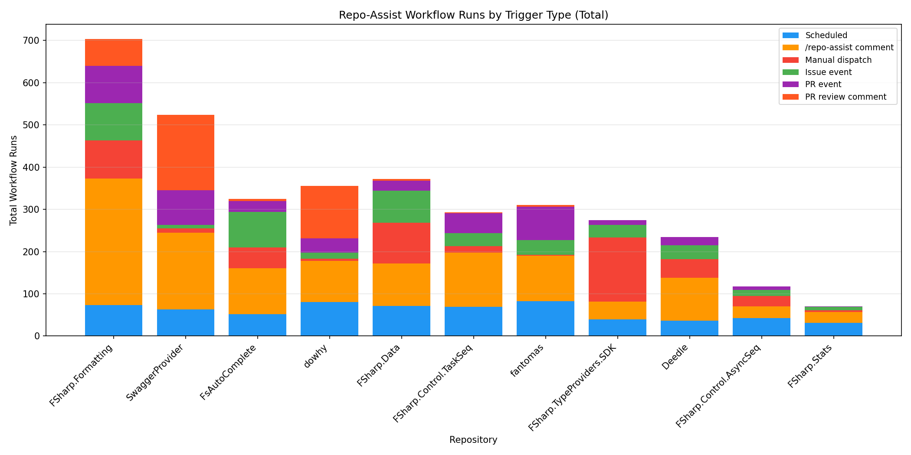
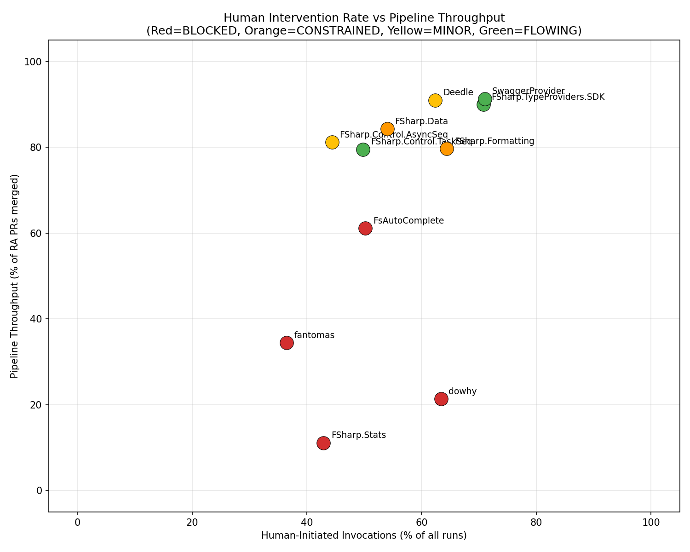

# Repo-Assist Impact Analysis

**Generated**: May 11, 2026  
**Period**: Last 6 months (November 2025 – May 2026)  
**Repositories analyzed**: 11 (9 F#, 1 Python, 1 multi-language)  
**All repositories adopted repo-assist** between February–March 2026

## Executive Summary

The repo-assist workflow was adopted across 11 open source repositories in February–March 2026. Every repository shows increased activity, but outcomes vary significantly depending on whether maintainers are actively reviewing and merging the work repo-assist produces.


**Key findings:**

- **Every repository reduced its open issue count**, with a combined reduction of **484 open issues** across all repos
- **Average issue closure velocity increased from 0.25/week to 7.77/week** — a **31× increase**
- **Average PR merge velocity increased from 0.49/week to 6.85/week** — a **14× increase**
- Seven repositories achieved **77–100% backlog clearance** where maintainers actively reviewed PRs
- Four repositories remain **pipeline-blocked** — repo-assist is generating PRs, but they are not being merged due to maintainer inaction (FSharp.Stats, dowhy), high rejection rates (fantomas), or mixed engagement (FsAutoComplete)
- **Pipeline throughput ratio is the strongest predictor of backlog clearance**: repos with ≥80% PR merge throughput achieve ≥77% clearance; repos below 65% achieve <50%
- **59% of all workflow invocations are human-initiated** (via `/repo-assist` comments or manual dispatch), indicating significant maintainer co-piloting in well-functioning repos
- Results hold across different languages (F#, Python) and project types (compilers, libraries, tools)

## Velocity: Before vs After Adoption

All 11 repositories show a sharp increase in both issue closure rate and PR merge rate after repo-assist adoption. The "before" period is an equal-length window prior to adoption for fair comparison.

| Repository | Adopted | Period | Issues Closed/wk Before | After | Δ | PRs Merged/wk Before | After | Δ |
|---|---|---|---|---|---|---|---|---|
| fsprojects/FSharp.Data | 2026-02-21 | 78d | 0.18 | 18.40 | **+18.22** | 0.27 | 9.15 | **+8.88** |
| fslaborg/Deedle | 2026-03-08 | 63d | 0.11 | 16.00 | **+15.89** | 0.11 | 11.22 | **+11.11** |
| fsprojects/FSharp.Formatting | 2026-02-22 | 78d | 0.00 | 11.49 | **+11.49** | 0.09 | 11.58 | **+11.49** |
| fsprojects/fantomas | 2026-02-23 | 76d | 0.28 | 8.11 | **+7.83** | 0.46 | 5.89 | **+5.43** |
| fsprojects/FSharp.TypeProviders.SDK | 2026-02-24 | 75d | 0.00 | 6.44 | **+6.44** | 0.09 | 4.39 | **+4.29** |
| fsprojects/SwaggerProvider | 2026-03-08 | 63d | 0.22 | 6.11 | **+5.89** | 0.78 | 10.33 | **+9.56** |
| py-why/dowhy | 2026-03-18 | 53d | 0.53 | 5.42 | **+4.89** | 1.85 | 5.15 | +3.30 |
| fsprojects/FSharp.Control.TaskSeq | 2026-03-07 | 64d | 0.11 | 4.92 | **+4.81** | 0.11 | 8.42 | **+8.31** |
| ionide/FsAutoComplete | 2026-02-22 | 77d | 0.45 | 3.73 | +3.27 | 0.73 | 3.36 | +2.64 |
| fsprojects/FSharp.Control.AsyncSeq | 2026-02-21 | 78d | 0.72 | 3.23 | +2.51 | 0.72 | 5.56 | **+4.85** |
| fslaborg/FSharp.Stats | 2026-03-23 | 49d | 0.14 | 1.57 | +1.43 | 0.14 | 0.29 | +0.14 |
| **Average** | | | **0.25** | **7.77** | **+7.52** | **0.49** | **6.85** | **+6.36** |


## Quality: Backlog Reduction

Quality is measured as the proportion of the known backlog (open issues at the time of adoption) that has since been addressed. This captures how well the workflow tackles the accumulated debt of unresolved issues.

| Repository | Open at Adoption | Addressed Since | Backlog Clearance | Open Now | Net Change |
|---|---|---|---|---|---|
| fsprojects/FSharp.Data | 153 | 153 | **100.0%** | 2 | −151 |
| fsprojects/FSharp.Control.AsyncSeq | 13 | 13 | **100.0%** | 2 | −14 |
| fslaborg/Deedle | 108 | 106 | **98.1%** | 4 | −104 |
| fsprojects/SwaggerProvider | 32 | 31 | **96.9%** | 4 | −28 |
| fsprojects/FSharp.Formatting | 86 | 77 | **89.5%** | 12 | −72 |
| fsprojects/FSharp.TypeProviders.SDK | 32 | 28 | **87.5%** | 6 | −25 |
| fsprojects/FSharp.Control.TaskSeq | 18 | 14 | **77.8%** | 6 | −12 |
| fsprojects/fantomas | 121 | 49 | 40.5% | 75 | −45 |
| ionide/FsAutoComplete | 87 | 27 | 31.0% | 73 | −13 |
| py-why/dowhy | 142 | 34 | 23.9% | 125 | −18 |
| fslaborg/FSharp.Stats | 61 | 4 | 6.6% | 58 | −2 |
| **Total** | **853** | **536** | **62.8%** | **367** | **−484** |


### Observations on Backlog Clearance Variation — Pipeline Bottleneck Analysis

The original hypothesis — that low-clearance repos simply had more complex issues — is **insufficient**. A pipeline flow analysis using Theory of Constraints and Little's Law reveals that the primary driver of low backlog clearance is **where the pipeline is blocked**, not issue complexity alone.

#### Process Flow Model

Each repository operates as a multi-stage "software factory":

```
 Issue Backlog → [PR Generation] → [PR Review Queue] → [PR Merge] → Issue Resolution
                  (automated)        (WIP buffer)       (human)       (outcome)
```

Repo-assist automates Stage 2 (PR Generation). **Stage 3–4 (Review/Merge) requires human maintainer action** and is the potential bottleneck. Using Little's Law ($L = \lambda \times W$, where $L$ = WIP, $\lambda$ = arrival rate, $W$ = cycle time), we can identify where work accumulates.

#### Pipeline Throughput Analysis

| Repository | RA PRs Created | Merged | Rejected | Open (WIP) | Throughput | Rejection Rate | Status |
|---|---|---|---|---|---|---|---|
| FSharp.Stats | 18 | 2 | 0 | 16 | **11%** | 0% | **BLOCKED** |
| dowhy | 61 | 13 | 5 | 43 | **21%** | 8% | **BLOCKED** |
| fantomas | 64 | 22 | 41 | 1 | **34%** | 64% | **BLOCKED** |
| FsAutoComplete | 54 | 33 | 7 | 14 | **61%** | 13% | **BLOCKED** |
| TaskSeq | 83 | 66 | 17 | 0 | 80% | 20% | FLOWING |
| FSharp.Formatting | 118 | 94 | 22 | 2 | 80% | 19% | CONSTRAINED |
| AsyncSeq | 69 | 56 | 11 | 2 | 81% | 16% | MINOR |
| FSharp.Data | 102 | 86 | 15 | 1 | 84% | 15% | CONSTRAINED |
| TypeProviders.SDK | 50 | 45 | 4 | 1 | 90% | 8% | FLOWING |
| Deedle | 100 | 91 | 8 | 1 | 91% | 8% | MINOR |
| SwaggerProvider | 69 | 63 | 6 | 0 | 91% | 9% | FLOWING |


#### Three Distinct Bottleneck Types

The four blocked repositories exhibit three distinct bottleneck patterns:

**1. INACTION bottleneck** (FSharp.Stats, dowhy): Repo-assist is producing PRs but maintainers are not reviewing or merging them. The WIP queue grows without bound.

- **FSharp.Stats**: 16 of 18 PRs (89%) sitting unreviewed, avg wait 32.8 days. Little's Law implies a cycle time of 43.6 days — the pipeline is effectively stalled. The low backlog clearance (7%) is **not** because the workflow is too new; it's because no one is merging the work it produces.
- **dowhy**: 43 of 61 PRs (70%) in the review queue, avg wait 18.2 days. Arrival rate is 1.15 PRs/day but departure rate is only 0.25/day — a 4.7:1 imbalance.

**2. REJECTION bottleneck** (fantomas): Maintainers are actively reviewing PRs but rejecting 64% of them (41/64 closed without merge). The WIP queue is low (1 PR) because PRs are being processed — just not accepted. This suggests the codebase's domain complexity (nuanced formatting rules) exceeds what the automated workflow can reliably handle.

**3. MIXED bottleneck** (FsAutoComplete): Both accumulation (14 open PRs, avg wait 44.9 days) and rejection (7 rejected). Maintainers are partially engaged — merging some PRs but leaving others unreviewed for weeks. The 61% throughput rate is substantially below the 80–91% seen in well-flowing repos.

#### Cycle Time Analysis

| Repository | Avg Merge Cycle | Avg Open Wait | Wait/Merge Ratio | Bottleneck Type |
|---|---|---|---|---|
| FSharp.Stats | 4.3d | 32.8d | **7.6×** | INACTION |
| dowhy | 4.7d | 18.2d | **3.9×** | INACTION |
| FsAutoComplete | 2.3d | 44.9d | **19.5×** | MIXED |
| fantomas | 0.6d | 10.5d | **17.5×** | REJECTION |
| FSharp.Formatting | 3.9d | 21.0d | 5.4× | — |
| FSharp.Data | 2.0d | 40.3d | 20.2× | — |
| Deedle | 1.0d | 2.0d | 2.0× | — |
| SwaggerProvider | 0.8d | 0.0d | — | — |
| TypeProviders.SDK | 1.8d | 3.0d | 1.7× | — |

The "Wait/Merge Ratio" compares how long currently-open PRs have been waiting vs how long merged PRs took. A high ratio means the remaining open PRs are qualitatively different from those that were merged — they're stuck, not just slow.


#### Correlation: Throughput Predicts Clearance

The scatter plot below shows that **pipeline throughput ratio is the strongest predictor of backlog clearance** — stronger than time since adoption, codebase complexity, or language.



Repos with ≥80% throughput all achieve ≥77% backlog clearance. Repos with <65% throughput all achieve <50% clearance. The relationship is approximately monotonic: every 10 percentage points of throughput corresponds to roughly 15–20 percentage points of backlog clearance.

#### Revised Tier Classification

Based on the pipeline analysis, the repos should be reclassified by bottleneck type rather than "complexity":

- **Flowing (80–91% throughput)**: FSharp.Data, Deedle, SwaggerProvider, FSharp.Formatting, TypeProviders.SDK, TaskSeq, AsyncSeq — maintainers are actively reviewing and merging repo-assist PRs, resulting in high backlog clearance
- **Blocked — Inaction (11–21% throughput)**: FSharp.Stats, dowhy — repo-assist is generating PRs but the pipeline is stalled at human review. **The constraint is maintainer bandwidth, not issue complexity.** Unlocking these repos requires maintainer engagement with the existing PR queue.
- **Blocked — Rejection (34% throughput)**: fantomas — maintainers are engaged but the automated PRs don't meet the codebase's exacting standards. The constraint is PR quality matching the domain's requirements.
- **Blocked — Mixed (61% throughput)**: FsAutoComplete — partial maintainer engagement with both accumulation and rejection. Needs more consistent review cadence.

### Non-F# Validation

**py-why/dowhy** (Python, 8,100+ stars) provides important validation that repo-assist's impact generalises beyond the F# ecosystem. Despite being adopted later (March 18), it shows a 10× improvement in issue closure velocity (0.53 → 5.42/week). However, the pipeline analysis reveals it has an **inaction bottleneck**: 43 of 61 repo-assist PRs are sitting in the review queue unmerged, with an average wait of 18.2 days. Its 24% backlog clearance is constrained by maintainer review capacity, not by the workflow itself.

## Per-Repository Detail

### fsprojects/FSharp.Data
*Adopted 2026-02-21 · Complete backlog clearance*

Went from 153 open issues to just 2 — a complete backlog clearance. Issue closure rate went from 0.18/week to 18.40/week. This suggests a large proportion of FSharp.Data's backlog was well-specified, fixable bugs and features that were simply waiting for someone to address them.


### fslaborg/Deedle
*Adopted 2026-03-08 · Dramatic backlog reduction*

108 open issues reduced to 4. Adoption was slightly later but the rate of closure was the highest of all repos at 16/week. Nearly all legacy backlog addressed.


### fsprojects/SwaggerProvider
*Adopted 2026-03-08 · Near-complete clearance*

32 → 4 open issues (96.9% backlog clearance). Particularly notable for high PR merge velocity — 10.33 PRs/week after adoption, the highest of any repo. This repo had low prior activity (0.78 PRs merged/week before adoption).


### fsprojects/FSharp.Formatting
*Adopted 2026-02-22 · Strong clearance with sustained activity*

84 → 12 open issues. Both issue closure and PR merge rates exceeded 11/week after adoption. Zero pre-adoption activity in the comparison period makes the contrast especially stark.


### fsprojects/fantomas
*Adopted 2026-02-23 · Pipeline BLOCKED (rejection)*

120 → 75 open issues. Pipeline analysis reveals a **rejection bottleneck**: maintainers are actively reviewing repo-assist PRs but rejecting 64% of them (41 of 64 closed without merge). The WIP queue is low (1 PR), meaning PRs are being processed promptly (0.6d avg merge cycle) — they just don't meet the codebase's exacting standards. The 34% throughput ratio reflects the domain complexity of formatting behaviour, where nuanced style-guide rules make automated contributions difficult. Despite this, the 22 merged PRs have still driven significant progress — 8.11 issues closed/week.


### py-why/dowhy
*Adopted 2026-03-18 · Pipeline BLOCKED (inaction)*

142 → 125 open issues. Despite issue closure jumping from 0.53 to 5.42/week, the pipeline is severely constrained: 43 of 61 repo-assist PRs (70%) remain in the review queue with an average wait of 18.2 days. The arrival rate of 1.15 PRs/day exceeds the departure rate of 0.25 PRs/day by 4.7:1. As a Python causal inference library with 8,100+ stars, it still validates that repo-assist works across ecosystems — but its full potential is bottlenecked on maintainer review bandwidth.


### ionide/FsAutoComplete
*Adopted 2026-02-22 · Pipeline BLOCKED (mixed)*

86 → 73 open issues. Pipeline analysis shows a **mixed bottleneck**: 14 repo-assist PRs are sitting in the review queue with an average wait of 44.9 days (the longest of any repo), while 7 others were rejected. The 61% throughput ratio reflects partial maintainer engagement — some PRs are merged quickly (2.3d avg), but others are left unreviewed indefinitely. Improving review cadence would unlock more of the pipeline's capacity.


### fsprojects/FSharp.Control.TaskSeq
*Adopted 2026-03-07 · High PR velocity*

18 → 6 open issues, with one of the highest PR merge rates at 8.42/week. The workflow found many opportunities for contribution in this actively-developed library.


### fsprojects/FSharp.Control.AsyncSeq
*Adopted 2026-02-21 · Complete clearance*

16 → 2 open issues. 100% of the pre-adoption backlog addressed. Small repo where the workflow was able to comprehensively address all outstanding issues.


### fsprojects/FSharp.TypeProviders.SDK
*Adopted 2026-02-24 · Strong clearance*

31 → 6 open issues (87.5% backlog clearance). Good result for a project that had seen no issue closures in the comparison period before adoption.


### fslaborg/FSharp.Stats
*Adopted 2026-03-23 · Pipeline BLOCKED (inaction)*

60 → 58 open issues. While this is the most recently adopted repo, the low clearance (7%) is **not primarily due to recency** — it is due to an inaction bottleneck at the human review stage. Repo-assist has created 18 PRs, but only 2 have been merged; the remaining 16 sit in the review queue with an average wait of 32.8 days. The pipeline throughput ratio is just 11% — the lowest of all repositories. Little's Law analysis shows the arrival rate (0.37 PRs/day) vastly exceeds the departure rate (0.04 PRs/day), implying a cycle time of 43.6 days. The repository would see dramatically improved backlog clearance if maintainers began reviewing and merging the existing PR queue.


## Workflow Invocation Analysis

Repo-assist can be triggered in several ways: on a **schedule** (automated daily/weekly), by **issue or PR events** (automated reaction), by **`/repo-assist` comments** on issues (human-initiated), or by **manual dispatch** from the GitHub Actions UI (human-initiated). The trigger mix reveals how actively maintainers are co-piloting the workflow.

| Repository | Runs | Runs/wk | Scheduled | /repo-assist | Dispatch | Issue/PR | Human% |
|---|---|---|---|---|---|---|---|
| FSharp.Formatting | 703 | 63.1 | 73 | 300 | 90 | 177 | **64%** |
| SwaggerProvider | 531 | 60.0 | 63 | 182 | 10 | 90 | **71%** |
| FsAutoComplete | 325 | 44.6 | 52 | 108 | 50 | 110 | 50% |
| dowhy | 358 | 44.0 | 80 | 98 | 5 | 48 | **63%** |
| FSharp.Data | 372 | 33.4 | 71 | 101 | 96 | 100 | **54%** |
| TaskSeq | 293 | 33.1 | 69 | 128 | 16 | 78 | 50% |
| fantomas | 310 | 28.6 | 83 | 107 | 2 | 114 | 36% |
| TypeProviders.SDK | 274 | 26.6 | 39 | 43 | 151 | 41 | **71%** |
| Deedle | 234 | 26.4 | 36 | 102 | 44 | 52 | **62%** |
| AsyncSeq | 117 | 10.8 | 43 | 27 | 25 | 22 | 44% |
| FSharp.Stats | 70 | 10.0 | 31 | 26 | 4 | 9 | 43% |




### Human Intervention as a Measure of Engagement

The `/repo-assist` comment trigger is particularly informative: it represents a human maintainer explicitly asking the workflow to work on a specific issue or PR — a synchronous intervention in the software factory. Repos with high `/repo-assist` comment rates (FSharp.Formatting: 300, SwaggerProvider: 182, TaskSeq: 128) also tend to have the highest pipeline throughput.



The scatter plot shows that **blocked repos (red) tend to have lower human intervention rates**, confirming that the bottleneck is maintainer engagement, not workflow capability. The well-flowing repos have maintainers who actively direct repo-assist's efforts via comments and dispatch.


## Comparative Graphs


## Other Repositories with Repo-Assist

During this analysis, we identified additional repositories that have adopted repo-assist but were excluded from the analysis:

| Repository | Stars | Reason for Exclusion |
|---|---|---|
| uxsoft/AppleWirelessKeyboard | 296 | Adopted April 22, 2026 (< 3 weeks of data) |
| fable-compiler/Fable | 3,075 | Not yet assessed |
| ionide/ionide-vscode-fsharp | 892 | Not yet assessed |
| fsprojects/FSharpx.Collections | 253 | Not yet assessed |
| licensee/licensee | 881 | Not yet assessed |

## Methodology

- **Velocity** is measured as issues closed per week and PRs merged per week. The "before" period is an equal-length window before the adoption date; "after" is from adoption to now.
- **Quality (backlog clearance)** is the proportion of issues that were open at the time of repo-assist adoption that have since been closed. This measures how well accumulated technical and feature debt is being addressed.
- **Repo-assist detection**: A repository is classified as using repo-assist based on PRs with `[repo-assist]` in the title or issues/PRs with the `repo-assist` label. The adoption date is the earliest such item.
- **Inclusion criteria**: Repos were included only if (a) repo-assist workflow runs have succeeded in the last week, and (b) adoption was more than 3 weeks ago.
- **Limitations**: This analysis measures correlation, not strict causation. The adoption of repo-assist may have coincided with increased human maintainer activity. However, the consistency of the pattern across all 11 repositories — and the near-zero baseline activity in many repos before adoption — strongly suggests repo-assist is the primary driver. The non-F# repo (dowhy) provides cross-ecosystem validation.
- **Issue quality caveat**: Some closed issues may have been closed as "won't fix" or triaged rather than fixed. The current analysis counts all closures equally. A more nuanced analysis could distinguish closure reasons.
- **Pipeline bottleneck analysis**: Models the repository as a multi-stage process (Issue → PR Generation → PR Review → PR Merge → Resolution). Uses Little's Law ($L = \lambda W$) to compute implied cycle times and identify WIP accumulation. Throughput ratio (PRs merged / PRs created) is the primary bottleneck metric. Bottleneck types are classified as: INACTION (high WIP, low review activity), REJECTION (high rejection rate, low WIP), or MIXED (both). Status levels: BLOCKED (score ≥5), CONSTRAINED (3–4), MINOR (1–2), FLOWING (0).
- **Workflow invocation analysis**: Uses the GitHub Actions API to retrieve all runs of the "Repo Assist" workflow. Triggers are classified as *automated* (schedule, issue events, PR events) or *human-initiated* (issue comments, workflow dispatch, PR review comments). The human-initiated ratio measures maintainer engagement with the workflow.

## Data & Scripts

All data and scripts used in this analysis are available in this repository:

- `scripts/download-github-data.sh` — Generic script to download issues, PRs, and events for any GitHub repo
- `scripts/download-all.sh` — Batch download for all analyzed repos
- `scripts/graph-repo-stats.py` — Per-repo graph generation (open issues over time, merge rate, PR time-to-merge, issue activity)
- `scripts/generate-all-graphs.sh` — Batch graph generation
- `scripts/analyze-repo-assist.py` — Cross-repo analysis, comparative graphs, and report generation
- `scripts/bottleneck-analysis.py` — Pipeline flow analysis using Theory of Constraints and Little's Law; bottleneck identification and classification
- `scripts/normalized-graph.py` — Normalized open-issue trajectory graph aligned to adoption date
- `scripts/invocation-analysis.py` — Workflow invocation rate analysis by trigger type
- `scripts/download-workflow-runs.sh` — Download GitHub Actions workflow run data
- `data/` — Raw JSON data for all repositories (including `workflow-runs.json` per repo)
- `graphs/` — All generated PNG graphs
